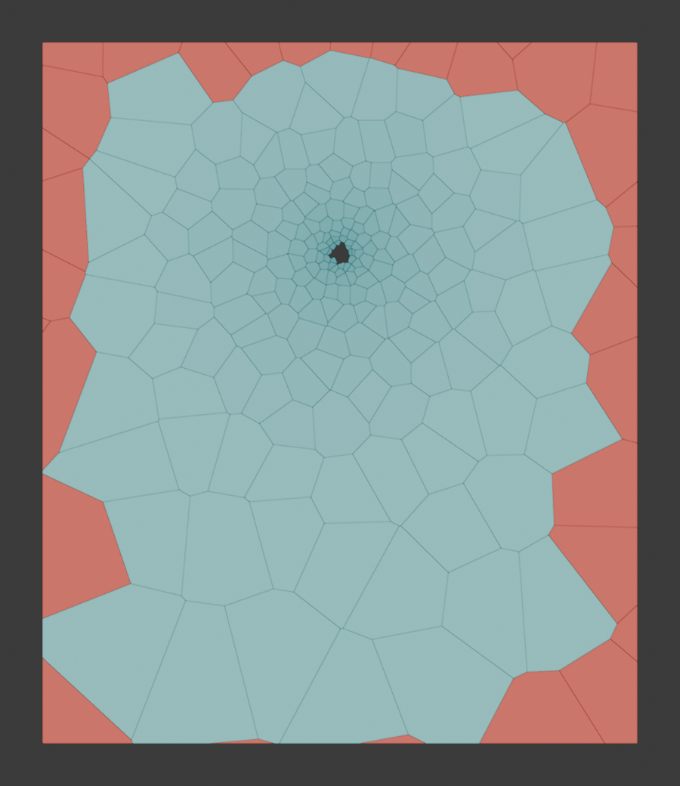
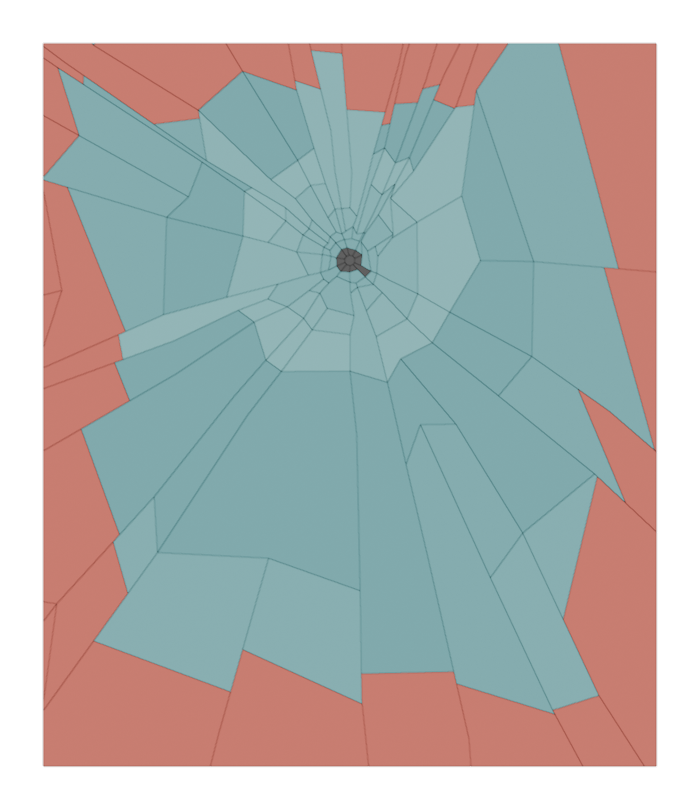
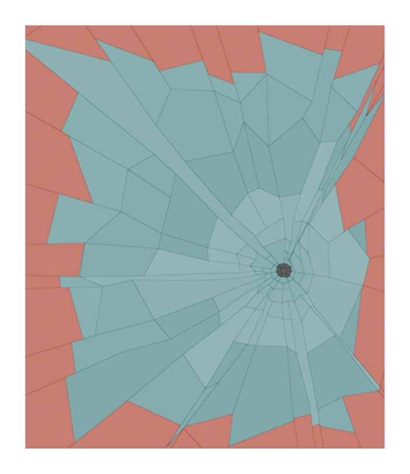

# 04 — Building staged glass breakage in FrontRooms (Unity 6000.3, URP 17.3)

Status: DONE (GD1, unity-implementation researcher), 2026-10-03 ~10:30.
Read-only for Red's project. Nothing under `Frontrooms3D/` changed except this folder: this file, `images/04_*.png` and `04_proto/` (prototype scripts + stats).
The prototype ran in Blender 4.3 headless, with its output in the session scratchpad. Unity was not opened.

Sibling reports in this folder: `01` conference destruction talks, `02` glass in shipped games and real 1990 window glass, `03` the micro-cutscene camera. This report covers how to build it in this project.

Conventions:
- `file:line` is relative to `Frontrooms3D/`, as read on 2026-10-03 around 10:00. The map chat edits `FrontRoomsMapWorld.cs` often, so lines drift; search for the quoted name.
- "Clone" means the glass track's private clone `scratchpad/proj_glass` (read, not edited).
- **MEASURED** = from the prototype run on this Mac. **ESTIMATE** = arithmetic or judgement. **UNVERIFIED** = not confirmed.

---

## 0. Short answer (for Red)

1. **You are right about the cause.** Games break glass with geometry built *before* the moment of breaking, swapped in on beats. Our crack is a shader drawing thin white lines on one flat box. The lines are the same width everywhere, they glow, they have no depth, and nothing actually breaks or moves (§2).
2. **The plan: three stages of real geometry, swapped on the sound beats we already have (0.35 / 0.70 / 1.0 s).**
   - **Stage 1:** crack "fins" inside the still-whole pane, plus a crushed spot at the impact.
   - **Stage 2:** the pane is replaced by its own pieces, in place. Each piece is tilted up to 0.8° and pushed up to 3 mm, so reflections split into facets.
   - **Stage 3:** pieces fall. Teeth stay in the frame, and glass stays on the floor (§4).
3. **The crack pattern is a crack graph, not Voronoi.** Plain Voronoi (what Blender's Cell Fracture makes) reads as "blobs" on glass. Real impacted glass shows long radial cracks with concentric cracks between them. My prototype builds that directly: radial cracks that wander and fork, concentric chords, cut to the frame, with teeth left in the stop.
   - **MEASURED:** 125–171 pieces and 6.6k–9.0k triangles per pane with a 0.6 mm bevel. Generation took 7.5–35 ms in plain Python, with one 129 ms outlier on a first call (§3, images).
4. **No fixed set of 18 variants.** Build the stage meshes when the hold starts, around the exact point the player pushed. Input is a per-glass-type profile plus a seed.
   - This is still "models built in advance, swapped stage by stage". They are just built 0.7–1.0 s ahead, and every break is unique.
   - With a fixed 3×3 grid, the crack centre lands up to about 24 cm from where you pushed. Most pushes also fall in the same one or two grid cells, so players would see repeats quickly.
   - Baked sets stay as a fallback (§3.4).
5. **Falling shards are real rigid bodies, but in a separate physics scene.**
   - Every gameplay query in this project uses the layer mask `~0`, and that includes the Ignore Raycast layer. So the "put shard colliders on Ignore Raycast" idea would not work here: the E ray and the Relay would hit them.
   - A separate physics scene hides the shards from every gameplay ray and from the player's capsule, with no change to the map chat's code or to the layer settings (§1.2, §6).
6. **The ChatGPT ray-tracing route is real, and it suits fractured glass.**
   - It drives the M3 Max's Metal ray tracing directly, going around Unity, which reports "no ray tracing". Each fracture piece is real geometry with its own normal, so the traced reflection breaks into misaligned facets for free.
   - **It is still a prototype.**
     - It runs only in the map test scene, not the game.
     - It has a field-of-view bug.
     - It paints over the glass instead of adding a reflection.
     - It rebuilds everything every second, and it is capped at 256 objects in total.
   - Fracture needs a few bridge changes: one instance per piece moved every frame, room for at least 1,024 instances, and each piece's acceleration structure built once and never refit (§1.3, §7, task rows in §12).
7. **WebGL is a separate, cheaper tier with the same beats and patterns.**
   - Changes: about 60 pieces, no bevel, opaque shards, simple scripted falling, all moving shards in one draw call, and no ray tracing or refraction.
   - Cost: at most about 4 extra draw calls during a break, then 1 per broken window (§9).
8. **What others need to do.** The map chat: a window root, the hit point in `Hold`, the `GlassCracked` / `WindowShattered` events, and not destroying our meshes along with the pane. The sound chat: keep the beats, plus optional shard-landing and teeth-snap hooks. You: the glass type per window, and the go-ahead for building at hold start rather than baking (§10).

---

## 1. What exists today

### 1.1 The map window (map chat's code)

- **Pane.** A Unity cube primitive called `Window pane {a}-{b}`. Its local scale carries its size (1.4 × 1.65 × 0.03, with the axes swapped by edge direction). It uses a URP Lit transparent material built in code, and it gets a `FrontRoomsMetalGlassTarget` (`FrontRoomsMapWorld.cs:1042-1052`, material `:2070-2088`).
- **Hold.** `Hold(Collider, dt, out progress)` (`:1891-1904`) does the following:
  - adds `dt`, and raises `GlassHold(position, progress)` every frame;
  - at 1.0 s, adds the edge to `brokenWindows`, removes the collider from `windowByCollider`, and calls `Kill(window.pane)`;
  - `Kill` destroys the pane **and every child of it**, then `GlassBroken(position)` fires.
  - Releasing E resets the hold to 0 (`:1906-1911`).
- **Hit point.** `UpdateAim` has the hit (`FrontRooms3DGame.cs:987`), but `Hold(aimed, dt, …)` never receives it (`:1006`).
- **Climb.**
  - It starts within 0.95 m of the frame and at most 0.45 m off-centre, and lasts 0.6 s with a 0.55 m duck (`FrontRooms3DGame.cs:936-976`).
  - The eye never drops below about 1.42 m during the climb (1.62 − 0.2 at the arc's peak).
  - A static `PlayerClimbed(Vector3)` event already exists (`:43`, `:959`), so the visual side can use it to snap the bottom teeth.
- **Camera.** FOV 76°, near plane 0.06 m (`:243`), reach 2.4 m (`:156`).
- **Sound.**
  - `FrontRoomsSoundDirector.OnGlassHold` fires the two crack one-shots when progress crosses 0.35 and 0.70, and drives the stress loop (`Audio/FrontRoomsSoundDirector.cs:490-502`).
  - `GlassBroken` drives Shatter.
- **Floors.** Both sides of every window have their floor top at the cell's y (`:817`), so a single analytic floor plane per window should be exact (ESTIMATE from that line: all cells appear to share y).

### 1.2 Every gameplay query sees every layer (important for shards)

- **Which queries:**
  - the E ray: `Physics.Raycast(…, Reach, ~0, QueryTriggerInteraction.Ignore)` (`FrontRooms3DGame.cs:987`);
  - the Relay's sight ray and nav capsule casts (`FrontRoomsMapHunter.cs:894, 911, 923, 992`);
  - the spawn check (`FrontRooms3DGame.cs:719`) and the walker (`FrontRoomsMapWalker.cs:132`).
- **They all pass `~0`, which includes layer 2, Ignore Raycast.** Only Unity's `Physics.DefaultRaycastLayers` leaves that layer out. The brief's assumption ("default raycast layers") does not hold here: a shard collider on Ignore Raycast **would** steal the E ray, block the Relay's sight and count as a nav obstacle.
- **The collision matrix is all ones** (`ProjectSettings/DynamicsManager.asset:20`). So the player's `CharacterController` (`FrontRooms3DGame.cs:576`) would also bump into shards on the floor.
- **The default contact offset is 0.01 m** (`DynamicsManager.asset:11`). That is more than half a 6 mm shard's thickness, so shards would rest about 1 cm above the floor unless the offset is set per collider.
- **Conclusion:** keep shard colliders out of the default physics scene altogether (§6).

### 1.3 The ChatGPT route: native Metal ray-traced glass reflections (explained, as Red asked)

**What it is, in plain words.**
- **Why it is needed.** Report 11 measured that Unity's own ray-tracing API says "no ray tracing" on Metal. Metal itself does support it: `MTLDevice.supportsRaytracing`, with hardware acceleration on M3-class GPUs.
- **What ChatGPT built.** A small native plugin that asks Unity for its Metal device and command queue, then does the ray tracing itself.
- **Every second it:**
  1. collects every glass pane (any object with `FrontRoomsMetalGlassTarget`), plus every MeshRenderer within 18 m of the nearest pane;
  2. builds one BLAS per unique mesh (the acceleration structure for that mesh's triangles);
  3. builds one TLAS over all of them (the scene-level structure that places each mesh with its transform).
- **Every frame it:**
  1. runs a compute kernel that shoots one ray per screen pixel from the camera;
  2. if the first thing hit is tagged glass, shoots one mirror reflection ray and writes the colour it finds;
  3. blends that picture over the finished frame in a URP pass.

**Files** (all added on 2026-10-03, 00:46–01:46):

| File | Role |
|---|---|
| `NativePlugin/FrontRoomsMetalGlassRT.mm` (763 lines) + `build_frontrooms_metal_glass_rt.sh` | Objective-C++ plugin. It holds the trace kernel in Metal Shading Language, compiled at runtime (`:132-304`), plus BLAS/TLAS builds and the render event. |
| `Assets/Plugins/macOS/libFrontRoomsMetalGlassRT.dylib` | The built plugin. Its exports match the C# imports (checked with `nm`). The `.meta` has only a GUID (59 bytes). |
| `Assets/Scripts/Rendering/FrontRoomsMetalGlassRT.cs` (394 lines) | `FrontRoomsMetalGlassTarget` (the marker component), `FrontRoomsMetalGlassRTController` (scene scan and per-frame event), the render-graph pass, and the P/Invoke wrappers. |
| `Assets/Scripts/Rendering/FrontRoomsMetalGlassRTRendererFeature.cs` | A URP renderer feature that enqueues the pass at `AfterRenderingPostProcessing`. It is added to `FrontRooms_URP_Renderer.asset` (line 95). |
| `Assets/Shaders/FrontRoomsMetalGlassRTComposite.shader` | A full-screen blend of the traced texture. |
| Edits in the **map chat's** file | `FrontRoomsMapWorld.cs:344-347` (create the controller) and `:1049` (tag each pane). The map chat should be told; these lines are in its file. |

**What works, and what blocks production** (by reading the code; it was not run for this report):

| Area | What the code does | Effect | Fix |
|---|---|---|---|
| Where it runs | `Ensure()` runs only when `standalone` is true (`MapWorld:346-347`). The main game builds the map with `standalone = false` (`:365`). | **The reflection runs only in `FrontRoomsMapTest.unity`, not in the game.** | Create the controller from the visual chat's render setup, gated to macOS. |
| Ray directions | C# writes the full vertical FOV in radians into the field the kernel uses as `tan(fov/2)` (`FrontRoomsMetalGlassRT.cs:238-242, 378`; kernel `.mm:263-265`). | At 76° the rays fan out 1.70× too wide, so the traced picture does not line up with the raster picture. | Pass `tan(fov/2)` now. Later, use the raster glass pixels instead of primary rays (RT2 in §12). |
| Compositing | Glass pixels are written with alpha 1 and blended `SrcAlpha, OneMinusSrcAlpha` **after post-processing** (`.mm:298-302`, composite shader `:45-47`, feature `:17`). | The traced colour **replaces** everything behind the pane. Face-on it is 0.15 × the reflection, so the pane would read as dark. It also skips tonemapping, bloom and grain. | Feed the texture into the glass shader's specular term before post, so the room behind the pane still shows through. |
| Shading the hit | A fixed "sun" direction, the material's base colour, and a blue sky gradient on a miss (`.mm:223-243`). | Reflections show flat-shaded, untextured shapes and a blue sky indoors. | Use the room lamps and albedo, and the zone cube on a miss. |
| Scene updates | Every 1 s, `RebuildScene` resets everything (`.cs:117-122, 162`). It rebuilds every BLAS with `waitUntilCompleted` on the main thread (`.mm:401-408`), rebuilds the TLAS the same way (`:483-490`), and calls `GetNativeVertexBufferPtr` for every mesh. Unity says that call "will synchronize with the rendering thread (a slow operation)" with multithreaded rendering, which is on (`ProjectSettings.asset:54`). | **Likely a hitch every second** (UNVERIFIED, not measured). Moving objects are up to 1 s stale. | Cache each BLAS per mesh. Fetch native pointers once. Update the TLAS every frame on the render thread. |
| Capacity | 256 meshes and 256 instances in total (`.mm:32`). Glass targets anywhere in the map are always included. Other renderers are taken in InstanceID order, not by distance (`.cs:145-157`). | The 18 m sphere very likely holds more than 256 renderers (ESTIMATE; report 11 counted 102 in a 12 m mirrored view), so what gets in is random. One shattered pane (about 150 pieces) would not fit. | At least 1,024 instances. Priority: glass and pieces first, then nearest. |
| GPU residency | The kernel reads vertex and index buffers through GPU addresses, and the TLAS references the BLASes, but the encoder never calls `useResource` (`.mm:597-613`). Apple: "Be sure to call useResource or useHeap to make the acceleration structures referenced in your instance acceleration structure available on the GPU" (WWDC23 10128). | Undefined behaviour. It may work by luck on unified memory. | Call `useResource`/`useHeap` for every BLAS and geometry buffer. |
| What it can see | MeshRenderer only, and submesh 0 only (`.cs:145, 186-187`). | **The Relay (skinned) is never in the reflection.** Multi-material meshes are partly missing. | Register all submeshes. Bake or refit skinned meshes, or keep the Relay-only planar overlay from report 11. |
| Output | A full-resolution `ARGBFloat` render texture (`.cs:253`). | 33 MB at 1080p; 4 floats where a half would do. | RGBA16F. |
| Other platforms | The controller calls native code only on macOS (`.cs:76-78`), but the `DllImport`s are compiled for every platform. | On WebGL, IL2CPP may report unresolved `FRGlassRT_*` symbols (UNVERIFIED). | Wrap the native class in `#if UNITY_STANDALONE_OSX \|\| UNITY_EDITOR_OSX`. |

**Verdict.** This is the right foundation for Red's "highest spec" glass on the Mac. It is real hardware ray tracing, it needs no HDRP, and its cost does not depend on how many renderers the camera sees, unlike the planar reflection in report 11. It needs the production pass in §12 (RT1–RT9) before it can carry the hero shot. The fracture work in this report is designed to drop into it (§7).

### 1.4 The running glass shader (clone, `Assets/Resources/Rendering/FrontRoomsGlass.shader`) — what to keep

| Keep | Why |
|---|---|
| Transparent, Preserve Specular, alpha `.08 + .55·Fresnel⁵`, green edge colour (`_AutoEdge`), smoothness under smudges, the long-wave roll normal, `_ReflectionMin` | This is the base glass look. It works for the intact pane and for the pieces. |
| Grime laid out in pane metres (dust low, smears 0.9–1.5 m, prints) (`:293-316`) | Must continue across the swap to pieces (see the change below). |
| `_Palm` (`:252-265`) and `_ImpactUV` | Stage 0, the push. |
| The `crush` term (`:244`), made smaller and texture-driven | The crushed core at the impact. |
| `FrontRoomsGlassPane.ImpactUV` (`Scripts/Rendering/FrontRoomsGlassPane.cs:26-36`) | Hit point → pane UV. |

| Drop or change | Why |
|---|---|
| `CrackMask` radial lines, rings and wedge tilt (`:219-250`) | Replaced by geometry. A shader-only tilt is invisible to the Metal ray tracer, which uses triangle normals, and it aliases (§2). |
| Crack scatter `3.0 * crack` in the emission (`:379-380`) | This is what makes the cracks glow. |
| Pane frame taken from the object's scale (`:188-211`), and the per-pane random value hashed from the object's centre (`:208-211`) | Pieces have their own transforms. Read pane metres from UV0 and the pane hash from UV1 instead, behind a uniform switch `_PaneFromUV`. Otherwise grime jumps at the swap. |
| The smear band from `positionWS.y` (`:301`) | Breaks once pieces fall. Use the pane-space height from UV0 plus the sill instead. |

### 1.5 Tools and packages on this Mac

- **Blender 4.3.0** at `/Applications/Blender.app`. Its bundled Python is 3.11.9 with numpy 1.24.3 and no scipy.
  - The **Cell Fracture extension is not installed**. The user extensions present are looptools, CityGenerator, blenderkit and plasticity. Installing it would be a download, and the plan does not need it.
- **No Houdini** (`mdfind` finds only Unreal's Niagara helper assets).
  - **Unreal 5.5** is installed (`/Users/Shared/Epic Games/UE_5.5`). Chaos fracture exists there, but there is no clean route from it to Unity, so it is not used.
- **Unity packages** (`Packages/manifest.json`, `packages-lock.json`):
  - direct: URP 17.3.0, Input System 1.18, UGUI, the physics module;
  - pulled in by URP: Burst 1.8.28, Collections 2.6.2, Mathematics 1.3.3, Shader Graph 17.3.0;
  - **no VFX Graph**.
- **URP settings.**
  - Opaque texture **off** (`FrontRooms_URP.asset:23`), with downsampling set to 2× (`:24`).
  - Depth texture on, MSAA 4×, HDR.
  - Vertex compression mask 4054 leaves **positions as Float32** (`ProjectSettings.asset:193`), which the ray-tracing bridge requires.
- **Kit pipeline.**
  - `kitlib.Kit.finish()` **joins every part into one object** (`Tools/Blender/frontrooms_kit/kitlib.py:632-688`), and `export()` writes one mesh with one submesh per slot (`:762-826`). That is right for props and wrong for fracture, which needs a pivot per piece.
  - `FrontRoomsKitImporter` handles only `Props/Models` and `Creatures`, and sets meshes non-readable (`Assets/Editor/Rendering/FrontRoomsKitImporter.cs:19-32`).

---

## 2. Why the current crack reads fake

The frames are `research/glass/images/04_crack_palm_hooks.jpg` and `03_window_close_masks.jpg`.

1. **Same width everywhere, and self-lit.** Each line is a 0.8 mm band plus anti-aliasing, lit by a scatter term of 3× the crack mask. Real cracks are planes running through the 6 mm of glass:
   - face-on you see a hairline, 1–2 px at 0.6 m (one pixel covers 0.87 mm there at 1080p and 76°, MEASURED by arithmetic);
   - at an angle you see a silvery ribbon up to 6 mm × sin(angle) wide;
   - brightness changes along the crack with the light and the view.
2. **Nothing breaks.** The pane stays one flat box. The "facets" are only a normal tilt inside the shader. With probe reflections that is hard to see, and the Metal ray tracer cannot see it at all, because it uses triangle normals.
3. **Spokes, not cracks.** The lines are the same spoke shape around a point, they all appear at once, and they do not fork. Real radial cracks wander slightly, fork outward, and end at earlier cracks.
4. **No crushed spot, no chips, no green edges, no displacement.**
5. **Aliasing.** Lines drawn inside a shader do not get MSAA. Geometry edges do. The project has 4× MSAA and no TAA (report 11), so cracks made of geometry stay clean in motion.

---

## 3. The fracture pattern

### 3.1 The physics that drives it (short; report 02 has the depth)

- **Pattern.**
  - A point impact on an annealed pane makes **radial cracks first**, then **concentric cracks** between them when the pane is held on all sides.
  - Later cracks stop at earlier ones (audit `interaction_audit/02_glass_and_breakables.md` §5.1, citing a forensic source).
  - Annealed glass breaks into "irregular and sharp pieces". Tempered glass breaks into "small rounded chunks" (same audit, citing Wikipedia "Tempered glass").
- **Speed.** Cracks in soda-lime glass run at well over 1 km/s. A search summary of arXiv:0911.0173 ("Dynamics of Simple Cracks") gives 1,325 m/s as the fastest measured in soda-lime glass; I could not read the PDF, so the exact figure is UNVERIFIED. **Each crack is complete in under a millisecond, which is less than one frame.**
  - So the gaps between the beats (0.35 → 0.70 → 1.0 s) are stress building up, not cracks growing.
  - Each new set of cracks should appear in **one frame**. A slow 60 ms "reveal" (the current proposal's `CrackReveal`) reads as a drawing effect.
  - A few centimetres of creep between beats is fine as art direction.
- **Glass types this must support:**
  - **annealed** (the default per the audit's art direction): big daggers and teeth;
  - **wired** (door lites, fire corridors): the wire holds the pieces, so stage 3 sags instead of falling. P2;
  - **tempered**: the whole pane fails at once into about 1 cm cubes. There is nothing at the beats except strain and chips; at 1.0 s comes a cascade of granules (particles) and no teeth.
  - Which glass a 1990 interior window has is report 02's and R9's call. The system takes the type as data.

### 3.2 Voronoi versus a crack graph (prototype, MEASURED)

I ran two generators in Blender 4.3 headless for a 1.4 × 1.65 m, 6 mm pane. Each piece was extruded to 6 mm with a 0.6 mm bevel, and triangles were counted exactly after triangulation. Scripts and stats are in `04_proto/`.

| | Plain Voronoi, seeds on jittered rings (what Cell Fracture or Chaos "Radial" produce) | Crack graph: radial tracks that wander and fork, plus concentric chords |
|---|---|---|
| Image | `images/04_a_plain_voronoi.png` | `images/04_b_crack_graph_eye_centre.png`, `04_c_…_eye_left.png`, `04_d_…_low_right.png` |
| Reads as | Cobblestones or a turtle shell. No continuous radial cracks. | Annealed glass after a hit: long radials, a spiderweb near the impact, daggers, teeth in the stop. |
| Pieces | 210–261 cells (23–29 under 1 cm²) | 125–171 in total: 89–123 shards, 25–36 teeth, 10–13 crush |
| Triangles (6 mm, 0.6 mm bevel) | 12.5k–15.5k | **6.6k–9.0k** (shards 4.7–6.6k, teeth 1.3–1.8k, crush 0.5–0.7k) |
| Mean vertices per piece | 5.8 | 4.6–4.9 (trapezoids and triangles) |
| Shard area p10 / p50 / p90 | — | 2.6–4.7 / 29–53 / 305–585 cm² |
| Generation time (CPython) | 50–99 ms | 7.5–35 ms, with one 129 ms first-call outlier (C# should be at least 10× faster, ESTIMATE) |
| Tiling check (area sum ÷ pane area) | — | 100.00% in 3 of 4 variants. 99.83% in `eye_left`: one 39 cm² corner hole from a dropped degenerate piece, which production validation must catch. |





Colours in the prototype frames: teeth are red, the crushed core is dark, and the other shards are grey-green.

**Prototype limits** (fix these in the production generator):
- radial tracks could cross before I clamped their order;
- a few very long daggers (up to about 30 × 110 cm in `eye_left`) need one secondary crack each;
- all teeth are kept, whereas production picks a subset.

### 3.3 The production generator (one C# source of truth)

`FrontRoomsGlassFracturePattern.Generate(profile, seed, impactUV, paneSize, rotation)` returns plain data. It is pure C#: no Unity objects and no threads, so it runs the same way on WebGL.

1. **Rings.** Radii grow geometrically: r₁ ≈ 3 cm and ×1.55 per ring until past the farthest corner. Each node jitters ±12%.
2. **Radial tracks.** Start with 8–12 tracks at jittered angles.
   - Each ring, a track wanders about 2° (Gaussian), clamped so it keeps its order and stays at least 0.02 rad from its neighbours.
   - From ring 2 outward, a wedge wider than 0.3 rad forks with probability 0.3. This gives the measured 28–39 tracks.
3. **Concentric chords.** In each wedge, a chord exists at ring k with probability falling from 0.97 at the centre to 0.45 at the edge. A missing chord merges the two bands, which is what makes the long daggers.
4. **Crush core.** Ring 0 (1.2 cm) gives tiny pieces. These become powder and crumb particles plus a small crater, not rigid bodies.
5. **Clip to the visible pane.** Use Sutherland–Hodgman against the rectangle. The visible pane includes the bite into the glazing stop: about 12 mm per side if the R9 window family has stops (UNVERIFIED value; R9 owns it).
6. **Teeth.** Each piece touching the frame is cut 6–24 cm in from the side it touches most, with the cut tilted ±25°.
   - The outer part is a **tooth** and stays. The inner part falls.
   - Caps: side teeth at most 0.18 m in the 1.2–1.8 m band. The climbing eye passes at least 0.1 m from them (§1.1 climb path), and the near plane is 0.06 m.
   - Head teeth tips must stay at or above 1.76 m. The eye stays at or below 1.62 m.
7. **Hierarchy.** Each piece records:
   - `band` and `cluster`: neighbouring pieces in the same wedge and band, which drive the release order (§6.2);
   - `primary`: the radial edges inside r_stage1 (25–35% of the way to the frame), shown at Crack1;
   - level-2 sub-cells for pieces over 60 cm², used for the floor re-break on desktop (§6.2).
8. **Validation, every build, which also runs as an edit-mode test:**
   - the area sum equals the pane area within 0.05%;
   - no crossing tracks;
   - every piece convex, or split into convex parts for colliders;
   - no piece under 1 cm² outside the crush core;
   - the same seed gives byte-identical output.

Profiles are ScriptableObjects (`FrontRoomsGlassTypeProfile`): `Annealed6`, `Wired6`, `Tempered6`. Each sets the counts above, the bevel, the tooth depth range and the tier caps. Red approves a profile by looking at Blender look-dev renders of generated samples (§3.5).

### 3.4 Where to build the meshes: baked variants or at hold start?

| | A. Baked variants (the old plan: 3×3 impact centres × 2 seeds = 18 per type) | **B. Built at hold start around the real hit point (recommended)** |
|---|---|---|
| Crack centre vs. where you pushed | Snapped to the nearest grid centre: **up to about 24 cm off** with a 3×3 grid (about 16 cm with 5×3). Visible when the micro-cutscene pushes in on the impact. | Exact. |
| Repeats | Most pushes land at eye height near the middle, so one or two grid cells take most breaks. In practice 2–6 looks. Chance of seeing a repeat in 5 breaks: 6 looks → 91%, 18 looks → 46% (birthday arithmetic). | None. Seed × hit point × rotation. |
| Persistence after a chunk rebuild | Store the variant id. | Store `{seed, impactUV, rotation}`. The generator is deterministic. |
| Disk | About 0.7 MB of mesh per variant (ESTIMATE, 9k triangles) × 18–30 per type | Profiles only (a few KB) |
| CPU at break time | None | Build during the first 0.3 s of the hold, sliced over frames. ESTIMATE: 1–5 ms total on desktop (C#), 3–10 ms on WebGL. Measure in GD3. |
| Fits Red's model ("pre-built stages, swapped stage by stage") | Yes | Yes. Stages are built 0.4–0.7 s before they are shown and swapped on the beats. Only the moment of building moves. |

**Decision.** Use B on both tiers. Keep A as a fallback: the same C# generator run from an editor menu (`FrontRooms/Glass/Bake Fracture Variants`) writes N variants as mesh assets. Ship those only if the WebGL measurement fails.

### 3.5 Blender's role (Blender 4.3, the kit pipeline)

The kit's single-mesh export (§1.5) is the wrong shape for pieces, so fracture gets its own small script next to the kit:
- `Tools/Blender/frontrooms_kit/glass_lookdev.py`: reads generator output (JSON written by a Unity editor menu) and renders Cycles look-dev frames of stages 1–3 for Red to approve, reusing `kitlib`'s preview setup.
- `assets/glass_crumbs.py`, a normal kit asset: 6–8 small crumb and sliver meshes (6–30 triangles each) for mesh particles, plus the crush crater (≤ 200 triangles).
- Baked textures (`kitlib` decal UVs):
  - a 256² tileable **fracture-face normal map** (hackle and Wallner lines, the ripples on a glass fracture surface);
  - a 128² crush mask;
  - a glint sprite.

No Cell Fracture and no booleans. The 2D crack graph plus an extrude is exact, convex and deterministic.

---

## 4. Stages and how they swap

Everything lives under the proposed unscaled window root `Window {a}-{b}`: opening centre, floor level, +Z into cell b (interactables `01_inventory.md` §2.5). Nothing of ours is ever a child of the scaled pane, which `Kill` destroys.

| Stage | When | Geometry (render-only, no colliders) | What the player sees | Metal RT (desktop) | WebGL |
|---|---|---|---|---|---|
| 0 Push | hold 0.00–0.35 | Intact pane: a 6 mm box with a chamfered rim (12–44 tris) | Palm smudge fades in (`_Palm`). The pane **bows** up to 3 mm toward the far side, and the reflection swims. Dust drifts from the stop. | Bow applied as an analytic normal in the kernel (no BLAS change) | Same, via the shader normal |
| 1 Impact | 0.35 (Crack1), one frame | Intact pane + **crack fins** (thin quads through the 6 mm, one per primary radial segment, ≤ 400 tris) + **crush core** crater (≤ 200 tris) | 5–8 cracks to 25–35% of the way to the frame. Each crack is a hairline face-on and a silver ribbon at an angle. A whitish crushed spot. 6–12 chips fall. Cracks creep 2–6 cm by 0.70. | Fins and crater are geometry, so they are in the TLAS | Same meshes, one draw |
| 2 Spiderweb | 0.70 (Crack2), one frame | **Stage-2 mesh:** all pieces combined into one mesh, each at its final pose. Tilt 0.2–0.8° and push 0.5–3 mm toward the far side, both falling off as e^(−r/0.35 m). Bevelled crack faces with the green edge. | All radials reach the frame and the concentric rings appear. **Reflections split into facets.** Thin dark and bright gaps show between pieces. | One BLAS for the stage-2 mesh, built between 0.35 and 0.70, swapped into the TLAS on the beat frame | Same, coarser (≈ 60 pieces, no bevel) |
| 3 Shatter | 1.00 (Shatter) | Stage-2 mesh hidden. **Piece renderers** at identical poses, pre-created and disabled during the hold. **Teeth** mesh. | Pieces release in waves (§6.2). Teeth stay. Glints and a dust puff. | One instance per moving piece (each piece's BLAS built once, during the hold). The TLAS updates every frame. | One skinned mesh, one bone per moving cluster |
| After | settle ≤ 2.5 s | Floor glass and teeth merged into one static mesh per window | Glass on both sides of the wall, about two thirds on the far side, with a glint field | Two BLAS (teeth, floor), built once | One draw |

**Swap rules, so nothing pops:**
1. Same root transform, same shader, same material. Pieces read pane-space UVs, so smudges, dust and prints stay exactly where they were (§1.4 shader change).
2. Swap **on the beat frame**, the same frame as the FMOD one-shot and the camera impulse. Both sides must key off the same thing: `GlassCracked` once the map provides it; until then, identical progress thresholds from `FrontRoomsShotTimings.Glass`.
3. The stage-2 pieces tile the pane exactly, so the silhouette is unchanged. Only new cracks and facets appear, which is what is meant to change.
4. The stage-3 pieces start at exactly the stage-2 poses. No jump at the shatter.
5. Chips spawn along the new cracks in the swap frame. This is the same trick shipped games use to cover a swap (see report 01).
6. Ray tracing: build the new acceleration structures before the beat, and switch instances in the TLAS on the beat frame.
7. No springy "settle" animation on the stage-2 facets. Real glass releases elastically within the crack time (§3.1), so the pose change is instant. It is also free for ray tracing that way, with no BLAS refits.

---

## 5. Crack rendering that reads real (desktop reference)

1. **Crack faces are geometry with their own normals.** The bevelled side faces of the pieces catch lamp highlights and reflections the way real fracture faces do. MSAA anti-aliases them.
   - Crack faces get the green float-glass edge colour (audit values), marked by vertex colour R = edge mask.
   - The fracture-face normal map adds hackle and Wallner ripples.
   - Edge chips come from a noise threshold on the edge mask.
2. **Stage-1 fins** are shaded as an internal glass-to-air interface: very smooth, with Fresnel close to 1 at grazing angles (total internal reflection). On screen that gives a hairline face-on and a silver ribbon at an angle, varying along the crack. Real cracks behave like this; constant-width lines do not.
3. **The reflection breaking into facets is the main stage-2 cue.** A 0.5° tilt deflects the reflected ray by 1°. That moves the reflected image by **1.7 cm at 1 m, 5.2 cm at 3 m and 10.5 cm at 6 m** (MEASURED, arithmetic), which is clearly visible.
   - It needs something to reflect, so it works with every reflection source:
     - zone cube (G6) or room probes (G7): facets sample different directions;
     - planar (report 11): offset the screen UV by the facet's normal minus the pane normal;
     - Metal ray tracing: exact.
4. **Refraction through flat facets is negligible. Do not fake it.** The lateral shift through a 6 mm, n = 1.52 slab changes by only **0.018 mm (face-on) to 0.042 mm (60° view)** for a 0.5° tilt (MEASURED, arithmetic). A shader that visibly shifts the background per facet looks like water.
   - Refraction is real only where the surface is strongly curved or seen edge-on: along bevels and chips, and through falling shards seen side-on.
   - **Desktop:** refract from the opaque texture only on edge-mask pixels and on shards.
   - The opaque texture is off today. A renderer feature that calls `ConfigureInput(ScriptableRenderPassInput.Color)` makes URP schedule the colour copy (`URP/Runtime/UniversalRendererRenderGraph.cs:960`, `UniversalRenderer.cs:1882`). So **request it only while cracked glass or shards are in view**, and pay nothing otherwise.
   - Downsampling: None on the desktop asset. Today's setting is 2×, and nothing else uses the texture.
5. **Crushed core.** Under a hard, small impact, glass crushes into a whitish powder spot and can spall a cone-shaped flake from the far side (a Hertzian cone).
   - Use the clone's `crush` term, made smaller (≤ 1.5 cm) and driven by the 128² mask, plus the crater mesh and 20–40 powder particles.
   - Whether the micro-cutscene's action is a strike or a push decides how big this gets (report 03).
6. **Grime continues across stages** (pane-space UVs), so the cracks cut through the existing dust and prints. This continuity sells the swap.
7. **Not decals.** URP decals do not project onto transparent surfaces ("The decal projection does not work on transparent surfaces", Manual `urp/renderer-feature-decal.html`). The DBuffer technique also excludes OpenGL ES (`urp/renderer-feature-decal-reference.html`). Everything stays in the glass mesh and shader.

---

## 6. Falling shards, floor glass, particles

### 6.1 Options

| Option | How | Gameplay rays and player (§1.2) | Look | Desktop cost (ESTIMATE) | WebGL | Metal RT |
|---|---|---|---|---|---|---|
| A. PhysX bodies in the main scene | Rigidbody + collider per piece | **Blocked.** Every query uses `~0`, so Ignore Raycast does not help. A new layer would need the map chat to change about 9 calls and the collision matrix. | Good | 150 bodies ≈ 0.3–1 ms/step | Too heavy | Fine (transforms) |
| **B. PhysX bodies in a local physics scene** | `SceneManager.CreateScene("FrontRooms Debris", new CreateSceneParameters(LocalPhysicsMode.Physics3D))`, stepped by us with `PhysicsScene.Simulate`. Proxy colliders for the floor, the wall with its opening, and nearby furniture boxes. | **Invisible to gameplay.** Unity: a local physics scene "cannot auto-simulate", and when simulated, "only components added to that Scene are affected" (Manual `physics-multi-scene.html`; `PhysicsScene.Simulate`). The static `Physics.*` queries run against the default physics scene (verify in a play-mode test, §11). | Best: tumbling, piling, sliding against furniture | 150 bodies ≈ 0.3–1 ms/step for ≤ 2.5 s | ≤ 40 bodies (UNVERIFIED cost in wasm) | Fine |
| C. Scripted ballistic motion | Our own integrator: gravity, spin, bounce on the analytic floor plane, plus a few boxes from the kit sidecar colliders | Invisible | Good for small pieces; no piece-on-piece contact | ≈ 0.05 ms for 60 pieces | **Yes** | Fine |
| D. Baked simulation as VAT or animation | Simulate offline, play back from a vertex-animation texture or an animation clip | Invisible | Art-directed, but ignores the actual furniture and the real hit point | Cheapest | Yes, only with baked variants (§3.4 A) | **No for VAT.** Ray tracing reads the mesh's vertex buffer, so VAT-moved shards are traced at rest and a ghost pane appears in reflections. |
| E. Mesh particles only | Particle System, mesh mode | Invisible | Fine for crumbs, poor for big daggers | Low | Yes | Not traced |

The VAT technique is real and widely used: SideFX Labs "Vertex Animation Textures" has a rigid-body mode that stores a pivot per piece (SideFX docs). FXVille's Ben Esler covered animating fracture pieces without baked simulations at GDC 2024. Neither changes the ray-tracing conflict.

### 6.2 Desktop (High and Cinematic): option B + E

- **Bodies.** One Rigidbody per falling piece, at most **150 per break**. Crush pieces and pieces under 4 cm² become particles.
  - **Collider:** a BoxCollider fitted to the piece's 2D minimum rectangle, inflated to **12 mm thick** (the render stays 6 mm).
  - **Contact:** `contactOffset = 0.002` (the default 0.01 would leave shards floating 1 cm up).
  - **Collision detection:** `CollisionDetectionMode.ContinuousSpeculative`.
  - **Mass** = area × 6 mm × 2,500 kg/m³: a 45 cm² shard weighs 68 g, a 400 cm² dagger 600 g (MEASURED, arithmetic).
- **Proxy colliders in the debris scene**, built when the hold starts:
  - the floor slab on both sides;
  - the wall with its opening (two jambs, the sill, the head);
  - boxes for every kit prop within 3 m, from the props' sidecar `colliders` (FrontRoomsKitLibrary `BoxDef`), or copies of their BoxColliders.
- **Release order** (cluster hierarchy, §3.3):
  - pieces within the first ring band go at t = 0, with the `WindowShattered` impulse times e^(−r/0.25 m) plus 10% random;
  - middle bands at 30–120 ms;
  - outer non-tooth pieces at 120–300 ms: they tip out of the stop and fall under gravity (a 1.2 m fall takes 0.49 s, MEASURED by arithmetic);
  - optional: one head tooth drops 1–3 s later or on `PlayerClimbed`, as a horror beat.
- **Second-level break on landing.** A piece over 60 cm² that hits the floor faster than 2 m/s swaps to its level-2 sub-pieces. These are built during the hold, for at most the 10 largest pieces. The swap emits a `ShardImpact` for sound.
- **Settle.** When a body's speed stays under 0.05 m/s for 0.3 s, it freezes. At 2.5 s at the latest, everything freezes. Then the floor pieces are merged into one static mesh (`Mesh.CombineMeshes`) and the bodies and proxies are destroyed.
- **Pre-creation.** Piece GameObjects, MeshRenderers and kinematic Rigidbodies are created **during the hold**, disabled, and pooled per active window. The shatter frame only enables them and sets their velocities.

### 6.3 WebGL: option C + E, one draw

- Use a coarser profile: about **60 pieces**, no bevel (≈ 15 tris per piece against ≈ 55 with the bevel), and at most **40 moving bodies**. Clusters move as one body.
- Moving shards are **one SkinnedMeshRenderer**, with one bone per moving body. WebGL2 skins on the CPU; GPU skinning is listed as a WebGPU-only feature (Manual `WebGPU-features.html`). About 2k vertices is cheap (ESTIMATE ≤ 0.2 ms with the integrator).
- Our own integrator: gravity, spin, and bounce on the analytic floor with restitution 0.2. Kit sidecar boxes are optional.
- Shards use the opaque `Glass_Shard` material: dark, smooth, with a green rim (audit §8.4). That avoids transparent sorting and overdraw.
- Persistent teeth and floor glass share **one** merged mesh per window.

### 6.4 Floor glass and persistence

- **Render-only, under the window root.** It is destroyed with the chunk, and nothing collides with it.
- **The map's per-edge record** `{stage, impactUV, seed, side}` (G9) rebuilds the stage and teeth deterministically.
- **Floor pieces' settled poses** are kept by the visual side in a registry keyed by edge id (≈ 4 KB per window, session memory). If a pose is missing, a seeded scatter stands in.
- **Footsteps on glass:** the registry answers `FrontRoomsGlassDebris.IsGlassAt(Vector3)` for the sound chat.
- **LOD.** The merged floor mesh gets a LOD1 that drops pieces under 10 cm² and the bevels. LOD1 switches at 10% of screen height and the mesh is culled at 2%, like the kit importer's rule.

### 6.5 Particles (built-in Particle System on both tiers; no VFX Graph)

| System | Desktop | WebGL |
|---|---|---|
| Chips at Crack1 / Crack2 (mesh crumbs) | 6–12 / 10–20, World collision, quality Medium | 3–6 / 5–10, Planes (floor) |
| Crush powder (soft billboards) | 20–40 | 10 |
| Shatter glints and crumbs | 200–400, World collision (the real map colliders; particles are not colliders, so gameplay is unaffected) | ≤ 60, Planes |
| Dust puff, 2 s | 1 system | 1 system |
| Floor glint field (static) | Part of the floor-glass material (a sparkle term) | Same |

The Collision module's World mode "High" uses the physics system, while "Medium (Static Colliders)" caches collisions in voxels (Manual `PartSysCollisionModule.html`).

VFX Graph is not installed and needs compute shaders, so it is out on WebGL2. On desktop it would be a separate project change for denser crumbs. Not needed for the first build.

### 6.6 Cost per break (ESTIMATES unless marked)

Draw-call costs use report webgl/03's figures: about 2 µs per batch in the desktop editor, and 26–40 µs per draw in WebGL.

| | Desktop High | WebGL |
|---|---|---|
| Build at hold start (C#, sliced) | 1–5 ms total over ~10 frames | 3–10 ms total over ~20 frames |
| Extra draws during the hold | +2–3 | +2–3 |
| Extra draws for ≤ 2.5 s after the shatter | +150–180 pieces + 3–4 particle systems ≈ 0.4 ms | +4 (teeth, skinned shards, 1–2 particle systems) ≈ 0.1–0.2 ms |
| Physics | Local scene, 150 bodies, 0.3–1 ms per step | Integrator ≤ 0.1 ms |
| Ray tracing | +150 instances. TLAS rebuild per frame, GPU microseconds (Apple: instance-structure rebuilds are the normal path for dynamic content; WWDC23). The trace itself does not depend on piece count. | — |
| Persistent per broken window | 2 draws (teeth, floor), ≤ 11k tris | 1 draw, ≤ 2.5k tris |
| Memory per broken window | ≈ 1–1.5 MB meshes (ESTIMATE) | ≈ 0.3 MB |

---

## 7. Fracture × Metal ray tracing: what the fracture assets need (asked)

1. **One instance per moving piece, all from one buffer.**
   - Rigid pieces never deform, so **each piece's BLAS is built once and never refit or rebuilt**. Only TLAS transforms change.
   - Apple: refitting "is much faster than a full rebuild" and suits deforming geometry (WWDC22 10105). Refitting cannot add or remove geometry (Apple refit documentation, read via search summary). Games "rebuild their instance acceleration structure each frame for their dynamic content", and you can split static from dynamic content so only the dynamic part is rebuilt (WWDC23 10128).
   - Bridge change: `FRGlassRT_AddMeshRanges(vb, ib, ranges[])`. One native pointer fetch for the whole fracture set. The BLASes are built in **one encoder in parallel**: Apple says many small builds run in parallel automatically on Apple Silicon, "up to 2.8 times faster" (WWDC22 10105).
2. **Counts.** Per window: stage 1 = 1–2 instances (pane + fins/crater), stage 2 = 1, stage 3 ≤ 150 + teeth 1, after = 2. The bridge cap must be at least 1,024 instances, filled glass and pieces first, then nearest (today: 256, random, §1.3).
3. **When to register.** Register the stage-2 mesh between 0.35 and 0.70 s, and the piece set between 0.70 and 1.0 s, a few meshes per frame. Each `GetNativeVertexBufferPtr` syncs with the render thread (Unity docs). Never register on the beat frame; switch the TLAS instance on it.
4. **Per-piece flags in the material table:**
   - bit 0 = glass (gets a reflection when it is the first hit);
   - bit 1 = fracture edge, read from vertex colour R so pieces stay single-submesh;
   - bit 2 = shard (reflection rays may skip pieces under 4 cm², through an instance mask).
   - The bridge reads **submesh 0 only** today, so either keep piece meshes single-submesh (recommended) or extend the bridge.
5. **Vertex format.** Position Float32×3 in stream 0, which the generator writes. 16-bit indices. The bridge rejects anything else (`.cs:176-179`).
6. **Lifetime.** Unregister pieces before merging them into floor glass. The bridge holds strong references to the vertex buffers, but stale instances would still be traced.
7. **No VAT on the ray-traced tier** (§6.1 D). The **bow** in stage 0 is an analytic normal, passed per instance as `{centre, amplitude}`, not a deformed mesh.
8. **Depth agreement.** Production traces reflection rays from the **raster glass pixels**: the glass pass writes normal and depth, and only reflection rays are shot.
   - Pieces mid-air, the Relay and particles then occlude correctly.
   - The FOV bug disappears.
   - Mirror-sharp reflections need **no denoiser**. Smudged areas would need 2–4 rays plus a blur (desktop Cinematic only).
9. **Windows desktop.** The bridge is Metal-only. Windows keeps report 11's planar reflection for the held pane. Facets offset the planar UV (§5.3). DXR through Unity's own API in URP is UNVERIFIED and not planned.

---

## 8. Recommended architecture

### 8.1 Components (visual chat unless noted)

| Component | Kind | Tier | Role |
|---|---|---|---|
| `FrontRoomsGlassTypeProfile` | ScriptableObject | all | Generator numbers per glass type and tier (§3.3) |
| `FrontRoomsGlassFracturePattern` | static C# | all | Deterministic crack graph → pieces, teeth, primary radials, clusters, level-2 sub-cells |
| `FrontRoomsGlassFractureMeshes` | C# builder (time-sliced IEnumerator) | all | Intact pane, fins, crater, stage-2 combined mesh, piece meshes, teeth mesh. UV0 = pane metres, UV1 = (pane hash, band, kind), colour R = edge mask. |
| `FrontRoomsGlassBreakable` | MonoBehaviour on the `Window {a}-{b}` root | all | Stage machine 0→3. Listens to map events for its window, swaps renderers on beats, hands pieces to debris, restores from the break record. |
| `FrontRoomsGlassDebrisWorld` | singleton | desktop: local physics scene; Web: integrator | Bodies, proxies, release waves, re-break, settle → floor glass, caps (one shattering window at a time, older ones settle immediately) |
| `FrontRoomsGlassFloorGlass` | per window | all | Merged teeth and floor mesh, LOD, settled-pose registry, `IsGlassAt` |
| `FrontRoomsGlassVfx` | prefab set | all (counts per tier) | Chips, powder, glints, dust |
| `FrontRoomsGlassRefractionFeature` | URP renderer feature | desktop asset only | Requests the opaque texture only while cracked glass or shards are visible |
| `FrontRooms/Glass` (+ `FrontRooms/GlassShard` opaque) | shaders | all | Changes from §1.4. No new keywords: uniform branches, to protect the WebGL variant budget |
| Metal RT bridge (`FrontRoomsMetalGlassRT*`) | native + C# | macOS desktop | Production pass RT1–RT9 (§12) plus the fracture API (§7) |
| `FrontRoomsShotTimings.Glass` and the shot camera | **map chat** | all | The micro-cutscene (report 03). Looks at the impact point we publish. |

### 8.2 Data flow (one break)

```
E held on pane ──► Game.UpdateAim (hit) ──► Map.Hold(collider, hitPoint, dt)          [map chat]
   │                                            │ GlassHold(window, hitPoint, progress) every frame
   ▼                                            ▼
GlassBreakable(window)                     SoundDirector: stress loop                  [sound chat]
 t=0.00  generate pattern(seed, impactUV) ─ sliced mesh build ─ pre-create pieces (disabled)
         stage 0: _Palm 0→1, bow normal; RT: bow params; publish ImpactPoint for the shot camera
 t=0.35  GlassCracked(window, 1) ──► stage 1: fins + crater ON (1 frame) + chips   ◄─ Crack1 one-shot
         RT: register stage-2 mesh (sliced)
 t=0.70  GlassCracked(window, 2) ──► stage 2: swap pane → combined pieces + chips  ◄─ Crack2 one-shot
         RT: register piece ranges (sliced)
 t=1.00  WindowShattered(window, hitPoint, impulse) ──► stage 3: pieces ON at the same poses,
         debris release waves, teeth stay, glints/dust; GlassBroken still fires     ◄─ Shatter
 +0.35…2.5 s  ShardImpact(pos, mass, speed) ──► sound (tinkles at real landing times)
 settle  merge floor glass; registry[edge] = poses; RT: 2 static BLAS
 later   PlayerClimbed(center) ──► snap bottom teeth (particles) ──► TeethSnap ──► sound
 chunk rebuilt  WindowBuilt(window, record) ──► Restore(stage, impactUV, seed, poses)
```

### 8.3 Event contract

| Event / call | Exists? | Owner | Payload | Visual | Sound |
|---|---|---|---|---|---|
| `Hold(collider, hitPoint, dt, out progress)` | change | map | + `hitPoint` (base-eye ray, never the shot camera) | impact point | — |
| `GlassHold(…, progress)` | exists | map | needs a window id + hit point (new overload or `GlassHoldStarted(window, hitPoint)`) | drive stage 0 | stress loop (unchanged) |
| `GlassHoldReleased(pos)` | exists | map | — | stop bow; **keep the stage** (cracks do not heal: audit §8.5) | stop loop |
| `GlassCracked(window, stage 1/2)` | new (G9) | map | — | stages 1 and 2 | may replace the thresholds (also fixes the replay-on-resume bug in the audit §8.5) |
| `WindowShattered(window, hitPoint, impulse)` | new (G9) | map | impulse = base-eye forward × 2–4 m/s for a strike, ≤ 1 m/s for a push (report 03 decides) | stage 3 | — |
| `GlassBroken(pos)` | exists, keep | map | — | ignored once `WindowShattered` exists | Shatter |
| `WindowBuilt(window, record)` / chunk-drop | new | map | `{stage, impactUV, seed, side}` | restore / clean up | — |
| `PlayerClimbed(center)` | exists (static) | game | — | snap bottom teeth | crunch (new) |
| `ShardImpact(pos, mass, speed)`, `TeethSnap(pos)` | new | visual → sound | — | — | tinkles, crunch |
| `FrontRoomsGlassDebris.IsGlassAt(pos)` | new | visual | — | — | glass footsteps |

### 8.4 Asset list and triangle budgets

| Asset | Source | Desktop budget | WebGL budget |
|---|---|---|---|
| Intact pane (6 mm, chamfered rim) | generated | ≤ 44 tris | 12 |
| Stage-1 fins + crush crater | generated + Blender crater | ≤ 400 + 200 | ≤ 150 + 60 |
| Stage-2 combined mesh | generated | **≤ 10k** (MEASURED 6.6–9.0k) | ≤ 1.5k (≈ 60 pieces, no bevel) |
| Stage-3 piece meshes | generated (same pieces) | ≤ 150 moving, ≤ 10k total | ≤ 40 bones, ≤ 1.5k |
| Level-2 sub-pieces (floor re-break) | generated, ≤ 10 parents × 2–5 | ≤ 2k | — |
| Teeth | generated | ≤ 2k (MEASURED 1.3–1.8k) | ≤ 400 |
| Floor glass merged (+ LOD1) | runtime merge | ≤ 9k (LOD1 ≤ 2k) | ≤ 1.5k (shared with teeth) |
| Crumb and sliver meshes ×6–8 | Blender kit `glass_crumbs.py` | 6–30 tris each | same |
| Fracture-face normal 256², crush mask 128², glint and dust sprites | Blender bake / CC0 | — | same, compressed |
| `Glass_Window` (+ held-pane copy), `Glass_Edge`, `Glass_Shard` | clone G3 | — | `Glass_Shard` for shards |
| Profiles `Annealed6`, `Wired6`, `Tempered6` × tier | ScriptableObjects | — | — |

### 8.5 Tier settings

| Setting | Desktop Cinematic | Desktop High (default) | WebGL |
|---|---|---|---|
| Pieces per pane | ≤ 170 | ≤ 150 | ≈ 60 |
| Bevel / edge normal map | 0.6 mm / yes | 0.6 mm / yes | none / no |
| Shard material | transparent + refraction (opaque texture) + RT | same | opaque `Glass_Shard` |
| Moving bodies | local physics scene, ≤ 170, re-break on | ≤ 150, re-break on | integrator, ≤ 40, re-break off |
| Particles at shatter | 400 | 250 | ≤ 60 |
| Reflection on the held pane | Metal RT (Mac) / full planar (Windows) | Metal RT / planar quarter→half res | Zone cube + Relay-only overlay (report 11) |
| Persistent draws per broken window | 2 | 2 | 1 |

All WebGL values sit behind `#if UNITY_WEBGL`, the WebGL quality level and the WebGL URP asset. Desktop is never reduced for the Web (memory rule, report 11 §3).

---

## 9. What the WebGL path changes (summary)

- **Same:** the generator code, profiles (coarser numbers), beats, events, stage logic and persistence.
- **Fewer and simpler pieces:** about 60, no bevel, opaque shards. No refraction feature, no ray tracing, no level-2 re-break.
- **Motion:** our own integrator, with all moving shards in one skinned draw.
- **Particles:** ≤ 60, colliding with planes only.
- **One merged mesh per broken window.**
- **Budget:** at most about 4 extra draws during a break against a WebGL frame budget of ≤ 600 (webgl/10_webgl_plan.md §1.1). Build cost is sliced over the first 0.35 s of the hold.
- **Measure in a browser (GD3):** the build time and the integrator plus skinning cost per frame.

---

## 10. Asks

**Map chat** (owns `FrontRoomsMapWorld.cs`, `FrontRooms3DGame.cs`, the camera). Most of this is G9:
1. An unscaled `Window {a}-{b}` root (interactables 01 §2.5). Disable the pane's MeshRenderer and keep its collider, which `windowByCollider` keys on.
2. `Hold(collider, hitPoint, dt, …)` and a window id plus hit point in the glass events. Add `GlassCracked` and `WindowShattered`, and keep `GlassBroken`.
3. On break, remove only the pane collider object. Never destroy the root, which our stage meshes hang from.
4. A per-edge break record `{stage, impactUV, seed, side}`, plus `WindowBuilt` (or a callback) on chunk rebuild and a notice on chunk drop.
5. The micro-cutscene uses our published impact point as its look target (report 03 for the shot itself).
6. **For the RT bridge:** the lines ChatGPT added to `MapWorld` (`:344-347`, `:1049`) should move to the visual side (RT1). The map then only builds the root and the collider.
7. **No layer or collision-matrix change is needed.** Shards live in their own physics scene.

**Sound chat:**
1. Keep Crack1, Crack2 and Shatter at 0.35 / 0.70 / 1.0. Consider firing the cracks from `GlassCracked`, so a resumed hold does not replay a crack.
2. Optional new hooks: `ShardImpact(pos, mass, speed)` for landing tinkles, `TeethSnap(pos)` on the climb, and `IsGlassAt(pos)` for glass footsteps.

**Red:**
1. The glass type per window: annealed (the default look), wired (door lites), tempered (granules). See report 02 for what 1990 actually used.
2. Building at hold start (B) versus baked variants (A) (§3.4). I recommend B.
3. Whether the RT bridge production pass (RT1–RT9) is in scope this term, since the fracture design works with or without it.

---

## 11. Build order for GD3, and how to verify it

1. Generator, profiles and edit-mode tests (tiling, crossing, convexity, determinism, timing).
2. Stage meshes and the shader changes (pane-space UVs, edge mask, fins, bow, drop the procedural cracks). Captures at hold 0.0 / 0.34 / 0.36 / 0.69 / 0.71 s.
3. Debris world (local physics scene) and release waves. Captures at 1.0 / 1.3 / 1.6 / 2.5 s.
4. Floor glass, teeth, persistence (rebuild the chunk and compare against the capture), and the climb with the teeth snap.
5. Particles and sound hooks.
6. WebGL tier: build-time and frame-time measurement in a browser.
7. RT bridge integration (after RT1–RT6).

**Play-mode tests** (in the clone, using the audit harness at seed 4242):
- The E ray, the Relay's sight ray and the nav capsule pass straight through the opening after the shatter, with debris moving in it. This proves the local physics scene is invisible to the static `Physics.*` calls.
- The E ray still hits the pane collider at every stage before the shatter.
- No collider exists in the default scene inside X ±0.70 × Y 0.35–2.00 after the break.
- The same seed and hit point produce the same pieces after a chunk rebuild.
- Batches and frame times per stage, on desktop and WebGL.

---

## 12. Proposed task rows (for `Documentation/VISUAL_CHAT_TASKS.md`; not filed by me)

| # | Task | Owner | Status |
|---|---|---|---|
| G13 (re-scoped) | **Metal RT glass reflections → production (macOS desktop)**: ChatGPT's bridge (§1.3). RT1 move the controller and the pane tagging out of MapWorld into visual render setup, run in the main game, `#if` macOS around the `DllImport`s (WebGL build safety). RT2 one-line FOV fix (`tan(fov/2)`), then reflection rays only from raster glass pixels (normal + depth from the glass pass). RT3 use the traced reflection in the glass shader's specular term before post (no overwrite). RT4 BLAS cache per mesh, per-frame TLAS on the render thread, ≥ 1,024 instances with priority, `useResource`/`useHeap`, no `waitUntilCompleted` on the main thread, native pointers fetched once. RT5 shade hits with albedo + room lamps + zone cube on a miss. RT6 fracture API (§7: mesh ranges, flags, per-frame transforms, bow params). RT7 the Relay: bake/refit, or keep the Relay-only planar. RT8 measure GPU ms at 1080p/1440p/4K in a player build. RT9 Windows: planar fallback. | visual | QUEUED (replaces the old "software rays" G13) |
| GD3a | Fracture generator + profiles + tests (§3.3) | visual | QUEUED after GD1 sign-off |
| GD3b | Stage meshes, swaps, shader changes (§4, §5) | visual | QUEUED |
| GD3c | Debris world (local physics scene desktop; integrator + skinned on WebGL) (§6) | visual | QUEUED |
| GD3d | Floor glass, teeth, persistence, climb snap (§6.4) | visual + map (record, events) | QUEUED |
| GD3e | Particles + sound hooks (§6.5, §10) | visual + sound | QUEUED |
| G8 | Re-scope: baked variants only as the fallback output of the generator (§3.4 A) | visual | WAIT on GD3a |
| G12 | Superseded by GD3a–e | — | close |

---

## 13. Open items / UNVERIFIED

1. **Ray-tracing bridge behaviour.** All findings in §1.3 come from reading the code; nothing was run for this report. That covers the FOV mismatch, the overwrite after post, the hitch every second and the residency issue. Verify each with a capture in a clone.
2. **WebGL and the `DllImport`s.** Whether IL2CPP for WebGL fails or warns on the unresolved `FRGlassRT_*` imports. Check the next WebGL build log.
3. **The local physics scene versus static queries.** That the static `Physics.Raycast`, `CapsuleCast` and `OverlapCapsule` calls ignore colliders in a `LocalPhysicsMode.Physics3D` scene. This is the documented purpose of multi-scene physics, but the docs I read do not say it in so many words. A test is planned in §11.
4. **Costs.** Every cost in §6.6 is an ESTIMATE. The prototype measured geometry and Python timings, not C# or a browser.
5. **Crack speed.** The soda-lime crack-speed figure came from a search summary of arXiv:0911.0173. I could not read the PDF.
6. **Glazing-stop bite.** The 12 mm bite into the glazing stop depends on R9's window family. Until then, the visible pane equals the 1.4 × 1.65 opening.
7. **Tempered and wired behaviour.** Tempered "dice" and wired "sag" are specified only at concept level. They are P2.
8. **Pane bow.** Whether 3 mm of bow is believable for 6 mm annealed glass under a hand push before it fails. It is art direction, not a calculation.
9. **Fracture talks.** The talk sources below were read at abstract level. Report 01 owns what each talk actually says.

---

## 14. Sources

**Conference talks** (read at abstract or summary level; not watched):
- "The Art of Destruction in 'Rainbow Six: Siege'" — Julien L'Heureux, Ubisoft — GDC 2016 — https://gdcvault.com/play/1023003/The-Art-of-Destruction-in
- "Destructible Environments in 'CONTROL': Lessons in Procedural Destruction" — Johannes Richter, Remedy Entertainment — GDC Summer 2020 — https://gdconf.com/news/get-lesson-procedural-destruction-control-devs-gdc-summer (summary: https://80.lv/articles/gdc-talk-destructible-environments-in-control)
- "Engineering Mayhem: Technical Deep-Dive into Environmental Destruction in 'THE FINALS'" — Måns Isaksson, Embark Studios — GDC 2024 — https://gdcvault.com/play/1034280/Engineering-Mayhem-Technical-Deep-Dive
- "Visual Effects Summit: Fracture Animation Techniques" — Ben Esler, FXVille — GDC 2024 — https://gdcvault.com/play/1034516/Visual-Effects-Summit-Fracture-Animation
- "Maximize your Metal ray tracing performance" — Apple — WWDC22, session 10105 — https://developer.apple.com/videos/play/wwdc2022/10105/
- "Your guide to Metal ray tracing" — Apple — WWDC23, session 10128 — https://developer.apple.com/videos/play/wwdc2023/10128/

**Documentation:**
- Apple, `MTLAccelerationStructureCommandEncoder` refit (read via a search summary) — https://developer.apple.com/documentation/metal/mtlaccelerationstructurecommandencoder/refit(sourceaccelerationstructure:descriptor:destinationaccelerationstructure:scratchbuffer:scratchbufferoffset:options:)
- Epic, "Fracturing Geometry Collections" (Uniform, Cluster, Radial and other tools; fracture levels) — https://dev.epicgames.com/documentation/en-us/unreal-engine/fracturing-geometry-collections-user-guide
- Blender Extensions, Cell Fracture (Blender 4.2+, "offered as is, with limited support") — https://extensions.blender.org/add-ons/cell-fracture/
- SideFX, Labs Vertex Animation Textures 3.0 (rigid-body mode, per-piece pivots; read via a search summary) — https://www.sidefx.com/docs/houdini/nodes/out/labs--vertex_animation_textures-3.0.html
- arXiv:0911.0173, "Dynamics of Simple Cracks" (crack speed in soda-lime glass; from a search summary, UNVERIFIED) — https://arxiv.org/abs/0911.0173
- Unity 6000.3.10f1 offline manual (`/Applications/Unity/Hub/Editor/6000.3.10f1/Documentation/en/`):
  - Manual: `physics-multi-scene.html`, `urp/renderer-feature-decal.html`, `urp/renderer-feature-decal-reference.html`, `PartSysCollisionModule.html`, `WebGPU-features.html`, `webgl-performance.html`;
  - ScriptReference: `PhysicsScene.Simulate.html`, `Physics-defaultPhysicsScene.html`, `Mesh.GetNativeVertexBufferPtr.html`, `Texture.GetNativeTexturePtr.html`, `Mesh.GetNativeIndexBufferPtr.html`, `Mesh.CombineMeshes.html`, `Mesh-isReadable.html`, `Graphics.RenderMeshInstanced.html`.
- URP 17.3 source (`Library/PackageCache/com.unity.render-pipelines.universal@37e0d4fc2503`): `Runtime/UniversalRenderer.cs:1112, 1870-1882`; `Runtime/UniversalRendererRenderGraph.cs:960`.

**Project files read:**
- `Assets/Scripts/FrontRoomsMap/FrontRoomsMapWorld.cs`, `FrontRoomsMapHunter.cs`, `FrontRoomsMapWalker.cs`, `FrontRoomsModuleUnits.cs`;
- `Assets/Scripts/FrontRooms3DGame.cs`, `Assets/Scripts/Audio/FrontRoomsSoundDirector.cs`;
- `Assets/Scripts/Rendering/FrontRoomsMetalGlassRT*.cs`, `NativePlugin/*`, `Assets/Shaders/FrontRoomsMetalGlassRTComposite.shader`;
- `Assets/Settings/FrontRooms_URP*.asset`, `ProjectSettings/{DynamicsManager,TagManager,ProjectSettings}.asset`, `Packages/manifest.json`, `packages-lock.json`;
- `Tools/Blender/frontrooms_kit/{kitlib.py, build_asset.py}`, `Assets/Editor/Rendering/FrontRoomsKitImporter.cs`, `Assets/Scripts/Office/FrontRoomsKitLibrary.cs`;
- in the clone: `Assets/Resources/Rendering/FrontRoomsGlass.shader`, `Assets/Scripts/Rendering/FrontRoomsGlassPane.cs`;
- research: `glass/11_reflections_and_raytracing.md`, `interaction_audit/02_glass_and_breakables.md`, `interaction_audit/FrontRoomsShotTimings.proposal.cs.txt`, `interactables/00_map_constraints.md`, `01_inventory.md` §2.5, `06_period_windows.md` (in progress), `webgl/03_measured_budgets.md`, `webgl/10_webgl_plan.md`, `VISUAL_CHAT_TASKS.md`.

**Secondary** (cited through the audit, not re-read): Glas Trösch EUROFLOAT (8% reflectance, 90% transmission for 6 mm), Wikipedia "Tempered glass", "Low-iron glass", and Forensic Field "glass fractures" — URLs in `interaction_audit/02_glass_and_breakables.md` §5.1.
