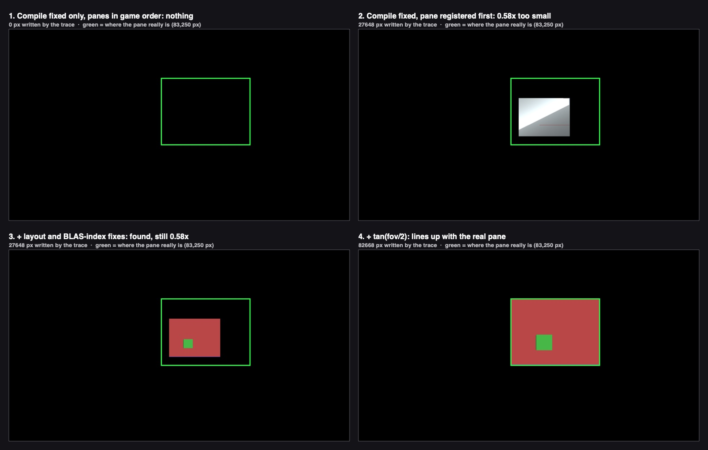

# 01 — Code review: the Metal ray-traced glass prototype (G14)

2026-10-03 · visual chat (游戏视觉) · workflow glass-rt-track, review stage · **status: DONE**

**What was reviewed.** ChatGPT's prototype, committed in `edfbc92` plus one controller edit, now committed in `c69c7d7`. That edit removed `emission` from the C# `MaterialDesc` so it matches the native 32-byte struct. When this review started, every file below was byte-identical between Red's project and the private clone `proj_rt`. Red's committed dylib is 75,744 bytes, sha1 `4bf02a4c2b227a328f8815fa889df4d3a5f6ba37`. Later in the run, the runtime-probe stage instrumented the clone's `.mm` and dylib. This review always used Red's committed versions.

| File | Lines | Role |
|---|---|---|
| `NativePlugin/FrontRoomsMetalGlassRT.mm` | 763 | Objective-C++ native plugin: BLAS/TLAS, runtime-compiled MSL kernel, render event |
| `NativePlugin/build_frontrooms_metal_glass_rt.sh` | 29 | clang build, arm64, macOS 13+ |
| `Assets/Plugins/macOS/libFrontRoomsMetalGlassRT.dylib(.meta)` | — / 2 | the built plugin; the `.meta` holds only a guid and no importer settings |
| `Assets/Scripts/Rendering/FrontRoomsMetalGlassRT.cs` | 394 | pane marker, controller (scene registration, per-frame event), RenderGraph pass, P/Invoke layer |
| `Assets/Scripts/Rendering/FrontRoomsMetalGlassRTRendererFeature.cs` | 34 | adds the pass at `AfterRenderingPostProcessing` |
| `Assets/Shaders/FrontRoomsMetalGlassRTComposite.shader` | 52 | full-screen alpha blend of the traced texture |
| `Assets/Settings/FrontRooms_URP_Renderer.asset` | 96 | the feature is added to the one shared renderer |
| `Assets/Scripts/FrontRoomsMap/FrontRoomsMapWorld.cs` | 345-347, 1049 | `Ensure()` in Awake (standalone only); marker on each pane (map chat's file) |

**How it was checked.**
1. **Line-by-line read** of every file above, against the Unity 6000.3.10f1 PluginAPI headers and the URP 17.3 / SRP Core package source in the clone's `Library/PackageCache`.
2. **Standalone harness (no Unity), using Red's committed dylib.** It loads the dylib through a fake `IUnityInterfaces` that hands it a real `MTLDevice` and queue. It then feeds the plugin exactly what `FrontRoomsMetalGlassRT.cs` would: the same struct layouts, the same EventData byte offsets, the same mesh de-duplication and the same instance order. Finally it reads the output texture back. Two patched copies were built **in scratch only** to expose the next layer of defects:
   - **P0:** the kernel compiles.
   - **FIXED:** P0 plus the layout, BLAS-index and residency fixes.

   Red's project and `proj_rt` were not modified by this review. The sources, fix diffs and logs are in `rt/harness/`.
3. **Cross-check against the runtime-probe stage's in-engine Play-Mode run** (same workflow): `proj_rt/Verification/rt_probe/probe_log.txt` and the crash log `scratchpad/rtprobe/run2_crash/unity_run2.log`. I did not start Unity on `proj_rt` myself, because the probe stage was using it (one Unity per clone).
4. **Primary documentation:** Apple Metal and Unity. The list is at the end.

Severity labels used throughout: **crash**, **wrong image** (including "nothing is drawn"), **hitch**, **quality**, **cleanup**.

---

## 1. Verdict

- **The idea is sound and now proven.** On Red's M3 Max, Unity loads the plugin (`UnityPluginLoad` receives `IUnityGraphicsMetalV2`) and Metal reports hardware ray tracing, while Unity's own `SystemInfo.supportsRayTracing` stays **False** (probe, in Play Mode). With the fixes below, the same kernel traces a correct one-bounce reflection in the right place on screen (figure, panel 4). This **supersedes the "no ray tracing on the M3 Max" conclusion of `glass/11`** for desktop Mac.
- **The prototype as committed has never drawn a reflection, and cannot.** Five independent blockers are stacked; fixing one exposes the next:
  1. The pass waits for a texture that only the pass itself creates, so it never runs (**R1**). The probe confirms: 0 render events, `IsReady` False.
  2. Open that gate and Unity **crashes on the first frame**: the compute pipeline is nil because the kernel compile is never attempted (**R2**). This reproduces in the harness (SIGSEGV) and in the Editor (probe stage: segfault in `RenderEvent` → `setComputePipelineState:`).
  3. If the compile were attempted, it would fail with **13 compile errors**: the `metal::raytracing` namespace is missing, and one variable has the same name as its type (**R3**).
  4. With those fixed, the kernel misreads every instance after the first, because the C++ struct is 88 bytes and the MSL struct is 96. With panes in their real registration order, **no glass is ever detected** (**R4**, figure panel 1).
  5. Every instance that uses a shared mesh is traced with someone else's geometry. Panes, lenses, door leaves and keys all share Unity's Cube (**R5**).
  6. After those, two more defects remain:
     - **Field of view:** it is passed in radians, so the reflection lands at 0.58x size (**R6**, panels 2–3).
     - **Composite:** an opaque blend after tonemapping would replace the view through the window with a dark mirror (**R7**).
- **What actually runs today:**
  - **Main game (`FrontRooms3D.unity`):** nothing. The map is created with `standalone = false`, so `Ensure()` never runs (probe: "controller NONE").
  - **`FrontRoomsMapTest.unity` and the Level Designer's Play preview:** the controller runs and **costs a 64–70 ms main-thread hitch every second** (probe: 70 BLAS builds, 180 instances) for zero visual result.
- **The ten suspected defects (§3):** 8 confirmed. 1 is partly right: ARC keeps Unity's buffers alive, so the real lifetime risk is a different one. 1 is not a defect in the current URP setup (the vertical flip), but it is fragile.
- I found **23 further defects** that were not on the list (§4).

## 2. Figure



`images/01_review_trace_output.jpg`: the plugin's raw output texture from the harness, flipped upright and brightened. The scene is a 2.0 × 1.5 m pane 3 m ahead of a 72° camera (the MapWalker FOV) at 1280×720. A red wall is behind the camera, a green cube behind it, a blue floor and a yellow side wall. The green outline is where the pane really is under Unity's projection (83,250 px).
- **Panel 1, P0** (the kernel compiles, everything else as shipped), instances in the order the game produces: wall, pane, prop, floor, side wall. **0 px**: no glass is found, because of the layout mismatch (R4).
- **Panel 2, P0 with the pane registered first.** Glass is found but drawn **0.58x too small** (27,648 px, bounding box 192×144 px instead of 333×250). The colours are garbage from misread instance data.
- **Panel 3, FIXED with the shipped FOV.** The reflection is right (red wall, green cube mirrored to the left), but still 0.58x.
- **Panel 4, FIXED with `tan(fov/2)`.** It matches the real pane to within 1 px (82,668 px).

## 3. The ten suspected defects, one by one

| # | Suspicion | Verdict | Evidence (finding) |
|---|---|---|---|
| 1 | FOV in radians in the tanFovY slot | **CONFIRMED**, wrong image | `.cs:240`; harness footprint ratio 0.578 = tan(36°)/1.2566 (**R6**) |
| 2 | Kernel row 0 + composite `1-uv.y` → vertical mirror | **NOT A DEFECT in this setup**, fragile | Any pass at `AfterRenderingPostProcessing` makes URP render post into an intermediate texture (`UniversalRendererRenderGraph.cs:1387-1389, 1418-1450`). Unity flips projection when rendering into textures on Metal, so memory row 0 = bottom of the view, and the kernel also writes the bottom of the view into row 0 (`.mm:260-265`). The composite's fixed `1-uv.y` is what Core's `GetFullScreenTriangleTexCoord` does on `UNITY_UV_STARTS_AT_TOP`, i.e. a row-for-row copy. Result: upright. It would mirror only if the target were the backbuffer, which cannot happen while the pass sits after post, with Intermediate Texture = Always. Robust fix in **R6**: build rays from the GPU projection matrix, or from depth. |
| 3 | Composite after post: linear HDR over the graded image, no bloom/grade/exposure | **CONFIRMED and worse**, wrong image | The blend is also opaque (alpha = 1), so the view through the window is lost (**R7**) |
| 4 | Primary re-trace against a partial scene, no depth test | **CONFIRMED**, wrong image | `.mm:260-279`; probe: 741 of 742 renderers in the game camera's frustum are not in the RT scene; skinned meshes and particles are never registered (**R9**, **R12**, **R13**, **R14**) |
| 5 | Rebuild every 1 s with `waitUntilCompleted` on Unity's queue from the main thread; unsynchronised globals | **CONFIRMED**, hitch (live) + crash (latent) | Probe: 64–70 ms per rescan; harness: 2.8–17 ms per 2k-triangle BLAS; races in **R24**, **R25** (**R10**) |
| 6 | BLAS hold Unity's buffers that may be freed when chunks stream out → stale geometry or GPU faults | **PARTLY.** ARC retains the buffers (`.mm:699, 702`), so Unity freeing a mesh cannot fault. The real risks are stale geometry for up to 1 s, and the plugin's own `Reset` freeing BLASes under an in-flight trace. | **R25**, **R26** |
| 7 | Hit shading ignores textures, lamps, emissive lenses, fog, wallpaper; blue sky on miss | **CONFIRMED**, quality | `.mm:223-243`, `.cs:322`; reads only the tint `_BaseColor`, never `_BaseMap` (**R18**) |
| 8 | The 30 mm cube pane has two reflecting faces; thin-glass double reflection not modelled | **CONFIRMED**, quality | The first hit wins; the 30 mm edge faces are flagged glass too (**R20**) |
| 9 | Feature in the shared renderer runs on WebGL/Windows | **Inert today, not provably inert**, cleanup | The main game never creates the controller; unguarded DllImports; native call in `OnDisable`; importer not pinned (**R22**) |
| 10 | GPU cost unmeasured | **MEASURED (rough)**: the GPU was shared with 4–5 other Unity processes | FIXED, 1080p: primary rays only 1.0–4.2 ms; pane covering the whole screen (2 rays/px) 3.4–7.8 ms. The probe stage owns the in-engine numbers. |

## 4. All findings, ranked

Each finding gives the location, what goes wrong in a concrete case, the severity, and the exact fix. `.mm` = `NativePlugin/FrontRoomsMetalGlassRT.mm`, `.cs` = `Assets/Scripts/Rendering/FrontRoomsMetalGlassRT.cs`, `Feature.cs` = `FrontRoomsMetalGlassRTRendererFeature.cs`, `Composite` = `FrontRoomsMetalGlassRTComposite.shader`.

### A. Blockers: nothing is drawn, or Unity crashes

**R1 — The pass can never run.** · **wrong image (nothing drawn)**
- **Where:** `.cs:53` `IsReady => ready && resultHandle != null`. `resultHandle` is assigned only in `EnsureResult` (`.cs:260`), which is called only from `Record` (`.cs:234`) after the `IsReady` gate (`.cs:231`). `Feature.cs:24` and `.cs:282` gate on the same `IsReady`.
- **What happens:** `resultHandle` is never allocated, so the pass is never enqueued, the plugin event is never issued and nothing is composited. Probe: "after two camera renders IsReady False · result texture null · RenderEvent calls 0". This deadlock is the only reason the crash in R2 does not happen in Red's Editor.
- **Fix:** gate on `ready` alone (`IsReady => ready`) and allocate the output inside the pass. Better: keep per-camera state (R17) whose RTHandle is created when the pass records, imported into RenderGraph with `renderGraph.ImportTexture`.

**R2 — Nil compute pipeline: Unity segfaults on the first traced frame.** · **crash**
- **Where:** `.mm:561-566`. The device-init event assigns `s_Device` and `s_Queue`, then calls `EnsureDevice()`. `EnsureDevice` returns at `.mm:318` (`if (s_Device && s_Queue) return true;`), so the kernel compile at `.mm:344-366` is never attempted and `s_TracePipeline` stays nil. `FRGlassRT_DeviceSupportsRaytracing` (`.mm:647-653`) still returns 1, so C# turns `ready` on. `RenderEvent` then calls `setComputePipelineState:nil` (`.mm:599`).
- **What happens:**
  - Harness: exit 139 (SIGSEGV); lldb shows `RenderEvent+192 → -[AGXG15XFamilyComputeContext setComputePipelineState:] → AGX::…setPipelineCommon`, a null read at 0x124. With Metal API validation, the run instead stops on the assertion that the compute pipeline state must not be nil.
  - Editor (probe stage, gate primed): "Got a segv while executing native code" with the same three frames, called from `GfxDevice::InsertCustomMarkerCallbackAndDataWithFlags` inside the SRP render loop (`ExecuteScriptableRenderLoop`).
- **Fix:**
  - `if (s_Device && s_Queue && s_TracePipeline) return true;`
  - Fetch the device and queue only if they are nil.
  - Compile once and remember a failure (`static bool s_CompileFailed`), so a broken kernel is not recompiled on every call.
  - `DeviceSupportsRaytracing` returns 1 only when the pipeline exists.
  - `RenderEvent` returns early when `!s_TracePipeline`.

**R3 — The kernel source does not compile (13 errors).** · **wrong image (no kernel)**
- **Where:** `.mm:134` has only `using namespace metal;`. `ray`, `intersector`, `triangle_data`, `instancing`, `intersection_result`, `intersection_type` and `instance_acceleration_structure` live in `metal::raytracing`, so there are errors at `.mm:230, 247, 267, 273, 275, 285, 291, 293`. In addition, `.mm:273` `auto intersector = intersector<triangle_data, instancing>();` names a variable after the type template, which gives 4 more errors even with the namespace added.
- **What happens:** once R2 is fixed, `newLibraryWithSource` fails, and the device reports RT support but never traces.
- **Fix:**
  - Add `using namespace metal::raytracing;` after line 134.
  - Line 273: `intersector<triangle_data, instancing> isect;`.
  - Lines 274 and 291: `isect.intersect(...)`.
  - Compile the kernel **offline** in the build script (`xcrun metal` → `.metallib`, loaded with `newLibraryWithData`), so a shader error fails the build instead of the game.

  The exact diff, verified to compile and run, is `rt/harness/plugin_p0_compile_fixes.diff.txt`.

**R4 — C++/MSL struct layout mismatch: the kernel reads garbage instance data.** · **wrong image / GPU fault**
- **Where:** the C++ `GpuInstanceInfo` (`.mm:88-99`) is **88 bytes** with the matrix at offset 40. The MSL `InstanceInfo` (`.mm:152-165`) is **96 bytes** with `objectToWorld0` at offset 48, because `float4` needs 16-byte alignment. Measured by a probe kernel compiled from the plugin's own MSL.
- **What happens:**
  - The kernel reads instance 0's transform from the wrong bytes, so its normals are wrong.
  - From instance 1 on, everything is read from the wrong bytes. Read-back for instance 1: `materialIndex` 0 (written 1), `triangleCount` 1,065,353,216 (written 13), index pointer `0x30`. For instance 2: `materialIndex` 1,085,276,160.
  - Material lookups go far out of bounds and vertex loads go to invalid GPU addresses, which is undefined behaviour. The same inputs gave mean colour (0.205, 0.232, 0.241) without GPU validation and (0.015, 0.020, 0.035) with it.
  - In the game's registration order the pane is never instance 0, so **no glass is detected** (figure panel 1).
- **Fix:**
  - Add `uint32_t pad[2];` before `objectToWorld` in `GpuInstanceInfo`, plus `static_assert(sizeof(GpuInstanceInfo) == 96)`. Alternatively, declare the rows `packed_float4` in MSL.
  - Add `static_assert`s for every struct shared across C#, C++ and MSL.
  - Run a one-time GPU self-test at init (the harness's `LayoutProbe` kernel) that disables RT if the sizes disagree.

  Diff: `rt/harness/plugin_fixed_layout_blas_residency.diff.txt`.

**R5 — Wrong BLAS per instance whenever a mesh is shared.** · **wrong image**
- **Where:** `.mm:431-441` builds `instancedAccelerationStructures` with one entry **per instance** (`s_Meshes[instance.meshIndex].blas`). But `.mm:478` sets `accelerationStructureIndex = meshIndex`, which Apple defines as an index **into that array**. The C# side de-duplicates meshes (`.cs:173-190`), so `meshIndex ≠ instance index` as soon as any mesh repeats.
- **What happens:** instance *i* is traced with the BLAS of mesh `instances[meshIndex_i].meshIndex`. In the harness, with [wall, pane(cube), prop(cube), floor, side wall], the floor is traced as a cube and the side wall as the floor. In the map, panes, troffer lenses (253 in one camera view, per the probe), door leaves and keys are all `CreatePrimitive(Cube)` and share one Mesh. So almost every instance registered after the second cube is traced with another object's geometry.
- **Fix:** build the array from `s_Meshes` in mesh order (one entry per mesh) and keep `accelerationStructureIndex = meshIndex`. Verified in FIXED (figure panels 3–4).

### B. Wrong image

**R6 — Field of view passed in radians where `tan(fov/2)` is expected (suspect 1).** · **wrong image**
- **Where:** `.cs:240` passes `camera.fieldOfView * Mathf.Deg2Rad`. The kernel uses it as tan(half-FOV) (`.mm:75, 264-265`).
- **What happens:**
  - Main game camera (76°): 1.3265 instead of 0.7813, rays 1.70x too wide.
  - MapWalker camera (72°): 1.2566 instead of 0.7265, rays 1.73x too wide.
  - The traced image is squeezed toward the screen centre. Reflections are painted over the wall near the centre and are missing from most of the real pane: 27,648 px written versus 83,250 px real (figure panel 2).
- **Fix:**
  - Minimum: `Mathf.Tan(0.5f * camera.fieldOfView * Mathf.Deg2Rad)`.
  - Production: pass `inverse(GL.GetGPUProjectionMatrix(camera.projectionMatrix, true) * camera.worldToCameraMatrix)` and build rays from NDC. That handles lens shift, physical cameras and the render-texture flip in one place (suspect 2).
  - Better still: no primary rays at all; take position and normal from depth or a glass G-buffer (R9).

**R7 — Opaque composite after post-processing (suspect 3).** · **wrong image**
- **Where:**
  - `Feature.cs:17` places the composite at `AfterRenderingPostProcessing`.
  - `Composite:12` blends with `Blend SrcAlpha OneMinusSrcAlpha`.
  - The kernel writes alpha 1 (`.mm:302`), and `Composite:46` keeps it at 1 for strength 1.
- **What happens:**
  - **The view through the window disappears** behind a dark mirror. The kernel's floor makes a head-on reflection 15–18% bright where real glass reflects about 4% (`.mm:298-301`).
  - The reflection is linear, unexposed and ungraded, blended into the graded and tonemapped image: no exposure, no grade, no bloom, no fog, no vignette, no grain.
  - A pane 30 m away in fog shows as a sharp, unfogged rectangle.
  - Strength is applied twice: kernel colour and composite alpha.
  - Any pass after post also forces URP to render post into an extra full-screen texture and add a final blit (URP `UniversalRendererRenderGraph.cs:1387-1450`).
- **Fix:** delete the composite.
  - The kernel outputs **radiance only** (no Fresnel, no strength) with A = coverage, into the global `_FR_GlassRTReflection`, and publishes `_FR_GlassRTWeight`.
  - The trace runs **before transparents**, once the depth texture exists.
  - The FrontRooms/Glass shader replaces its environment/planar term with it, still multiplied by its own Fresnel and grime. Grade, bloom and fog then apply as for the rest of the scene.
  - Status: as of this review, `proj_glass/Assets/Resources/Rendering/FrontRoomsGlass.shader` does not contain the hook yet.

**R8 — Missing residency for indirectly used resources.** · **crash / GPU fault (latent)**
- **Where:** `RenderEvent` (`.mm:597-614`) binds the TLAS and three buffers. It never calls `useResource` for the BLASes the TLAS points to, nor for the vertex and index buffers the kernel reaches through `gpuAddress` (`.mm:503-504, 191-196`).
- **What happens:** Apple says every resource reached indirectly must be flagged resident with `useResource`/`useHeap`. Otherwise its memory pages may be absent when the GPU runs, causing command-buffer failures, GPU restarts or image corruption (WWDC22 "Go bindless with Metal 3"; `useResource(_:usage:)` reference).
- **Fix:**
  - In `RenderEvent`, call `useResource:… usage:MTLResourceUsageRead` for every BLAS, vertex buffer and index buffer. FIXED does this and runs clean under Metal API validation.
  - Production: one `MTLHeap` for all BLASes plus `useHeap:`, or an `MTLResidencySet` on macOS 15+.

**R9 — Glass coverage is re-traced instead of taken from what the raster drew (suspect 4).** · **wrong image**
- **Where:** `.mm:260-279` decides "is this pixel glass" by tracing a primary ray against the RT scene only. There is no depth input.
- **What happens:**
  - Anything drawn but not registered blocks nothing, so the reflection is painted over it:
    - The Relay (a SkinnedMeshRenderer; only MeshRenderers are scanned, `.cs:145`).
    - Particles.
    - Renderers beyond the cap or outside the 18 m sphere.
    - Submeshes 1+: 8 registered renderers, 4,740 triangles (probe).
    - A door leaf that moved since the last 1 s rescan.
  - Things registered but not drawn (shadow-only renderers, culled layers) block reflections that should show.
  - Probe, main-game view: **741 of the 742 renderers in the frustum were not in the RT scene.**
- **Fix:**
  - Minimum: reject a glass hit that lies more than 2 cm behind the opaque depth at that pixel. `_CameraDepthTexture` exists (`m_RequireDepthTexture: 1`), and the glass does not write depth.
  - Production: a **glass G-buffer**. Panes and fracture pieces render position, normal and pane id into a small target, and the kernel traces reflection rays only from those pixels. That matches exactly what is drawn, cracks included.

**R10 — Full rebuild on the main thread every second (suspect 5).** · **hitch**
- **Where:**
  - `.cs:117-122` calls `RebuildScene` every `rescanSeconds` (1 s).
  - `.cs:162` `Reset()` throws everything away.
  - `.cs:181-187` calls `AddMesh` per unique mesh. Each one does a BLAS build with `commit` + `waitUntilCompleted` on **Unity's own queue** (`.mm:401-408`), so it waits behind Unity's in-flight frame. The TLAS build waits the same way (`.mm:483-490`).
  - `.cs:182, 185` call `Mesh.GetNativeVertexBufferPtr` / `GetNativeIndexBufferPtr` for every mesh, every second. Unity's docs say these synchronise with the render thread under multithreaded rendering, which the player uses (`m_MTRendering: 1`).
  - `.cs:145` runs `FindObjectsByType<MeshRenderer>` sorted by InstanceID over 3,782 renderers (probe).
- **What happens:**
  - In-engine (probe): **64–70 ms of main-thread time per rescan** for 70 meshes / 180 instances. BLAS work is 42–47 ms including waits; the managed part is 17–27 ms. That is about 4 dropped frames at 60 fps, once a second.
  - Harness: 2.8–17 ms per 2,048-triangle BLAS depending on GPU load, and 0.4–1.1 s for 201 meshes.
- **Fix:**
  - No periodic `Reset`.
  - Cache one BLAS per Mesh (key: Mesh instance ID). Build it once on the **render thread** (a plugin event encoding into Unity's command buffer), never wait on it, and compact it.
  - Drive scene membership from MapWorld chunk events (§7).
  - Rebuild or refit the TLAS every frame on the render thread from a CPU instance list. The probe measured the TLAS at 0.23–0.38 ms GPU for 180 instances.
  - Fetch native buffer pointers once per Mesh.

**R11 — Blank frame after every rescan (the `float4(0)` before the reset early-out).** · **wrong image**
- **Where:** `.mm:257-258` writes 0 and then returns when `reset && frameIndex > 0`. `.cs:218` sets `reset` on every rescan; `.cs:261` sets it on every resize.
- **What happens:**
  - The frame after each 1 s rescan has no reflection at all, a **1 Hz flicker**. Harness: coverage 0 on every reset frame.
  - With two cameras of different size (Scene view plus Game view in Play Mode), the texture is reallocated on every call, so reset is set every frame and there is never a reflection.
- **Fix:** delete line 258. There is no accumulation, so nothing needs a reset.

**R12 — `Camera.main` is null in the main game.** · **wrong image**
- **Where:** `.cs:126, 134`. The first-person camera is created untagged (`FrontRooms3DGame.cs:244-247`); only the MapWalker's camera is tagged (`FrontRoomsMapWalker.cs:66`).
- **What happens:** with `Camera.main` null, the focus becomes `targets[0]`, an arbitrary pane. The probe measured the registration centre **64 m from the camera**, so the panes in view had none of their surroundings in the RT scene.
- **Fix:** take the camera from the pass (`cameraData.camera`), or have the game register its camera. Never use `Camera.main`.

**R13 — Scene selection.** · **wrong image**
- **Where:** `.cs:145-157`.
- **What happens:**
  - (a) Every pane in the loaded map is registered regardless of distance and counts against the 256 cap. Probe: 38 panes, 33 of them beyond the radius.
  - (b) The cap cuts in InstanceID order (`break` at `.cs:155`), not by distance, so near walls can be dropped while far panes stay.
  - (c) Distance is measured to `renderer.bounds.center`. A 6 m shell block whose face is 15 m away but whose centre is 20 m away is dropped.
  - (d) The sphere is centred on one pane, not on the camera or on all visible panes. Rays that leave it miss and show the blue sky (R18).
- **Fix:**
  - Register all static geometry of built chunks. TLAS cost is small; a few thousand instances are fine.
  - If a cap is needed, sort by `bounds.SqrDistance(cameraPos)`.
  - Panes count like everything else.

**R14 — Submesh 0 and material 0 only; base vertex ignored.** · **wrong image**
- **Where:** `.cs:149` `renderer.sharedMaterial`; `.cs:178, 186-187` use `GetTopology(0)`, `GetIndexStart(0)` and `GetIndexCount(0)`; `GetBaseVertex(0)` is never applied.
- **What happens:**
  - Probe: 8 renderers lose 4,740 triangles; furniture and kit props are missing parts.
  - A mesh whose submesh 0 has a non-zero base vertex would index the wrong vertices. Metal has no base-vertex field.
- **Fix:**
  - One `MTLAccelerationStructureTriangleGeometryDescriptor` per submesh inside the mesh's BLAS.
  - The material comes from `hit.geometry_id`.
  - Base vertex: `vertexBufferOffset += baseVertex * stride`.

**R15 — The glass flag belongs to the material, not the instance.** · **wrong image**
- **Where:** `.cs:192-199`, `.mm:279`. The flag is set by whichever renderer first used the material.
- **What happens:**
  - A non-pane object that shares the glass material becomes "glass"; a pane whose material first appeared untagged does not.
  - `FrontRoomsMetalGlassTarget.reflectionStrength` (`.cs:17`) is never read.
  - Fracture pieces and crack states need per-instance data.
- **Fix:** per-instance flags in `InstanceInfo` (bit 0 glass, plus crack and edge bits), and instance mask bits (1 = opaque world, 2 = glass) so reflection rays can skip glass when wanted.

**R16 — A separate command buffer runs out of order with Unity's frame.** · **wrong image**
- **Where:** `.mm:597, 614` create a new command buffer on Unity's queue inside the event and commit it at once.
- **What happens:** the trace reaches the GPU before the rest of Unity's current command buffer, which holds the composite. With two cameras in a frame, both traces run before both composites, so camera 1 composites camera 2's trace (there is one shared texture). `IUnityGraphicsMetal.h` describes the intended path: end Unity's encoder and encode into Unity's command buffer.
- **Fix:** `s_Metal->EndCurrentCommandEncoder(); id<MTLCommandBuffer> cb = s_Metal->CurrentCommandBuffer();`, encode the compute pass into that buffer, and do not commit it.

**R17 — Every camera runs the pass, and they share one texture and one EventData block.** · **wrong image**
- **Where:** `Feature.cs:21-27` enqueues for every camera on the shared renderer: Game, Scene view, preview and reflection-probe cameras, and the Autopilot 1600×900 capture cameras (`FrontRooms3DGame.cs:1999-2069`). `.cs:43-44, 238-245` hold one texture and one 160-byte event block.
- **What happens:**
  - Cameras of different sizes reallocate the texture on every call (and reset it, R11).
  - The next camera overwrites the event block before the render thread reads it.
- **Fix:**
  - In `AddRenderPasses`, accept only `CameraType.Game` cameras that opt in through a small `FrontRoomsGlassRTCamera` component on the game camera.
  - Keep per-camera state (`Dictionary<Camera, State>`) with its own RTHandle and event block.

### C. Threading and lifetime (latent today because of R1; live as soon as it is fixed)

**R24 — Unsynchronised plugin globals.** · **crash**
- **Where:** `RenderEvent` (`.mm:583-615`, render thread) reads `s_OutputTexture`, `s_Tlas`, `s_InstanceInfoBuffer`, `s_MaterialBuffer` and `s_TracePipeline` without `s_StateMutex`. Meanwhile:
  - `Reset` (`.mm:662-675`) and `BuildTLAS` (`.mm:515-525`) assign them on the main thread.
  - `FRGlassRT_SetOutput` (`.mm:742-746`) assigns `s_OutputTexture` on the main thread every frame, with no lock.
  - `SetError` (`.mm:306-314`) writes the shared `std::string` from both threads; during a rebuild, `RenderEvent`'s "not ready" path writes it every frame.
  - `FRGlassRT_LastError` (`.mm:655-659`) returns a raw `c_str()` of that string to C#.
- **What happens:** these are ARC strong globals. A load that races a store-release can retain an already-freed object, which crashes. The string race can corrupt the heap.
- **Fix:**
  - Keep one immutable `Scene` snapshot (all ids and buffers) and swap it under the mutex, or as `std::atomic<std::shared_ptr<Scene>>`.
  - `RenderEvent` takes a strong copy at its start.
  - The error text is copied under a lock into a buffer the caller owns.

**R25 — `Reset` frees acceleration structures under an in-flight trace.** · **crash (GPU use-after-free)**
- **Where:** `.mm:665-673` drops the only strong references to the BLASes, TLAS and buffers.
- **What happens:** the previous frame's trace may still be running. Its command buffer retains what was bound (the TLAS and buffers), but not the BLASes or the `gpuAddress` buffers reached indirectly.
- **Fix:** keep each scene generation alive until the command buffers that used it complete (release it in `addCompletedHandler`), or defer the release by 3 frames.

**R26 — Buffer lifetime and staleness (suspect 6, corrected).** · **cleanup / wrong image (≤ 1 s)**
- **Where:** `(__bridge id<MTLBuffer>)` stored into strong `MeshRecord` fields (`.mm:699, 702`). ARC therefore co-owns Unity's buffers. This is correct ARC usage: `__bridge`, not `__bridge_transfer`, so there is no over-release.
- **What happens:**
  - When MapWorld frees a dropped chunk's meshes (`Unregister → FreeMeshes`), the buffers stay alive inside the plugin until the next `Reset`. There is no fault, but for up to 1 s the reflection can show **ghost geometry**: a dropped chunk's walls, or a broken pane. Memory is held as well.
  - PLAUSIBLE, unverified: if Unity's Metal backend sub-allocates or aliases mesh buffers in heaps, the retain would not protect their contents.
- **Fix:**
  - Drop the BLAS and buffer references on the chunk-release event (§7).
  - Fetch hit normals from a plugin-owned compact copy (positions and indices, or per-triangle normals) instead of Unity's vertex buffers. This also removes the dependence on Unity's vertex layout.

**R27 — `OnDisable` frees the event block an issued event may still read.** · **crash (rare)**
- **Where:** `.cs:109-113`. The render thread reads the `IssuePluginEventAndData` pointer when it executes the event, which can be later than the main thread.
- **Fix:** a 3-block ring of event data per camera, freed a few frames after the last use.

**R23 — `GetNativeTexturePtr()` every frame.** · **hitch**
- **Where:** `.cs:243`. Unity's docs say it synchronises with the render thread under multithreaded rendering, per camera, per frame.
- **Fix:** fetch it once when the texture is created.

### D. Quality

**R18 — Hit shading is a placeholder (suspect 7).** · **quality**
- **Where:** `.mm:223-243`. Material colour × a fake sun N·L (direction 0.35, 0.82, 0.28) plus 3.5% ambient. A miss returns a blue sky gradient that reaches (0.16, 0.24, 0.38) at the top.
- **What is missing:**
  - **No textures.** `.cs:322` reads only the `_BaseColor` tint. FrontRooms/Surface multiplies `_BaseMap` by that tint, so the wallpaper, carpet and ceiling-tile prints are lost. Walls with a near-white tint reflect as white.
  - **No lamps.** MapWorld lights a few dozen of about 1,581 lights within 16 m; the trace uses none.
  - **No emissive troffer lenses.** Their glow is set per lamp through a MaterialPropertyBlock, which the RT never sees.
  - **No fog.**
  - **The sky is wrong:** a windowless office has none.
- **Fix:** this is P1 of the track: texture sampling with world-metre UVs and `_TileSize`, emission plus the lit-lamp list, the zone cubemap on miss, and fog. The design stage owns it.

**R19 — Fresnel floor and double strength.** · **quality**
- **Where:** `.mm:298-301`. `mix(0.15, 1, F)` makes a head-on reflection 18% bright, against about 4% for glass (4.6x too bright). Strength is then applied to both colour and alpha.
- **Fix:** output radiance only and let the glass shader apply Fresnel (R7).

**R20 — Thin glass (suspect 8).** · **quality**
- **Where:** `MapWorld:1043-1048`. The pane is a 1.4 × 1.65 × 0.03 m cube (`GlassThickness = .03`, `FrontRoomsModuleUnits.cs:61`). That is a 30 mm collider, not 3–6 mm period glass.
- **What happens:**
  - Whichever face the ray hits first reflects.
  - The four 30 mm edge faces are flagged glass too, so bright strips appear at grazing angles.
  - There is no second, offset reflection from the back surface. Transmission is not traced either, which is correct: the raster draws it.
- **Fix:**
  - Trace against the visible slab planned in `interactables/06` §4.3 and move `FrontRoomsMetalGlassTarget` onto it, or against a zero-thickness quad at the pane centre.
  - If the double image is wanted, model the back surface in the glass shader: a second reflection offset by 2·t·tan θ, attenuated.

**R31 — The hardware gate is too wide.** · **quality / perf**
- **Where:** `supportsRaytracing` (`.mm:331, 652`) is also true on M1/M2 (Apple7/8), which trace on shader cores without RT hardware.
- **Fix:** gate the top tier on `[device supportsFamily:MTLGPUFamilyApple9]` (M3/M4). Measure M1/M2 before enabling it there; not measured here.

### E. Platform, build, cleanup

**R21 — The composite shader is stripped from player builds.** · **cleanup (feature dead in builds)**
- **Where:** `Feature.cs:13` uses `Shader.Find`. The shader is in `Assets/Shaders`, is not in Always Included, and no asset references its guid `ba638da3…`.
- **What happens:** macOS player builds strip it, the material is null and the feature does nothing. It works in the Editor (probe: "Shader.Find in editor: True").
- **Fix:** a `[SerializeField] Shader` on the feature, so the renderer asset keeps it. After R7 the composite is deleted anyway.

**R22 — WebGL/Windows inertness is accidental (suspect 9).** · **cleanup**
- **Why it is inert today:**
  - The main game never creates the controller.
  - `AddRenderPasses` returns at `controller == null`.
- **Why that is not proof:**
  - (a) Nine `DllImport`s compile on every platform (`.cs:345-353`). Whether IL2CPP for WebGL links them statically (link error) or at runtime (caught exception) is UNVERIFIED; see `webgl/10_webgl_plan.md` §7.4.
  - (b) `OnDisable` calls native `Reset` unconditionally (`.cs:114`). On Windows/WebGL that attempts a library load, with the exception swallowed. On Mac, a duplicate controller destroyed in `OnEnable` resets the live one's scene.
  - (c) `MapWorld:346-347` calls `Ensure()` on every platform in standalone play.
  - (d) The dylib's `.meta` has no importer block, so Unity recomputes defaults. Probe: Editor on with OS/CPU unset, StandaloneOSX on with CPU AnyCPU, Win64/WebGL off, not preloaded. The dylib itself is arm64-only.
- **Fix:**
  - `#if UNITY_EDITOR_OSX || UNITY_STANDALONE_OSX` around the native class and every call.
  - `AddRenderPasses` first does `if (cameraType != Game || SystemInfo.graphicsDeviceType != GraphicsDeviceType.Metal) return;`.
  - `OnDisable` touches native code only if `nativeAvailable`.
  - Pin the importer with the `PluginImporter` API: Editor OS = OSX, CPU = ARM64; StandaloneOSX CPU = ARM64; everything else off; `isPreloaded = true`, so `UnityPluginLoad` runs at startup and sees device init.
  - Any WebGL renderer asset must not list the feature (WebGL plan pre-flight check).

**R28 — Leaks.** · **cleanup**
- **Where:** `EnsureResult` (`.cs:251-252`) calls `RenderTexture.Release()` but never `Destroy`. `RTHandle.Release` on an external texture does not destroy it (SRP Core `RTHandle.cs:222-231`: `m_RTHasOwnership` is false), so one RenderTexture object leaks per resize. Separately, `Feature.Create()` (`Feature.cs:13-14`) makes a new material on every call, the Editor calls it repeatedly while validating the renderer asset, and `Dispose` frees only the last one.
- **Fix:** `CoreUtils.Destroy(result)`, and destroy the old material inside `Create()`.

**R29 — RenderGraph hygiene.** · **cleanup**
- **Where:** `.cs:294-298`. The unsafe pass sets globals through the raw command buffer without `builder.AllowGlobalStateModification(true)`. The result texture is never imported into the graph, so RenderGraph cannot see the dependency.
- **Fix:** `renderGraph.ImportTexture`, `builder.UseTexture`, and allow global state (or `SetGlobalTextureAfterPass`).

**R30 — Small items.** · **cleanup**
- `maxInstances` allows up to 512 (`.cs:34`) but the native cap is 256 (`.mm:32, 731`), so above 256 registration fails, and after the first warning it stays silent (the `warned` latch at `.cs:224-225`). `.cs:213` sets `ready = false` with no message at all.
- The catch at `.cs:221` handles only three exception types.
- The output texture is `ARGBFloat`: 16 bytes per pixel, 33 MB at 1080p, where RGBAHalf would do.
- Trace command buffers have no completion or error check (`.mm:614`).
- BLASes are not compacted.
- The dylib's install name is an absolute path into Red's project. Add `-install_name @rpath/libFrontRoomsMetalGlassRT.dylib` to the build script.
- Device shutdown (`.mm:568-580`) leaves `s_Meshes` holding the old device's buffers.

**R32 — Static batching (latent).** · **cleanup**
- **Where:** Standalone static batching is on (`m_StaticBatching: 1`). No scene object is static today (0 static flags in the three scenes), and the map is built at runtime, so nothing is batched now.
- **What would go wrong:** if something becomes static-batched, `sharedMesh` returns the combined world-space mesh, submesh 0 is another object, and the object's own transform is applied on top.
- **Fix:** skip `renderer.isPartOfStaticBatch`, or use its submesh range with an identity transform.

## 5. The specific checks requested

- **ARC ownership of the bridged Unity buffers.** `__bridge` into strong fields means +1 retain and release on `Reset`. The ARC usage itself is correct (R26 for the consequences). `SetOutput` holds the output texture the same way, and races the render thread (R24).
- **Transform layout.** Correct. `MTLPackedFloat4x3` is column-major with `columns[3]` as the translation. `.mm:471-475` puts `(row0[c], row1[c], row2[c])` into `columns[c]`. Verified: the traced pane lands on the analytic footprint to within 1 px.
- **`float4(0)` before the reset early-out.** Confirmed: one blank frame per rescan or resize (R11).
- **Struct sizes, C# ↔ C++ ↔ MSL:**

  | Struct | Sizes (C# / C++ / MSL) | Result |
  |---|---|---|
  | `MaterialDesc` | 32 / 32 | matches |
  | `InstanceDesc` | 56 / 56 | matches |
  | `EventData` | offsets 0–95 / 96 bytes / 96 bytes | match. C# allocates 160 bytes and never writes `pad0`, which is unused. |
  | `GpuMaterial` vs `MaterialInfo` | 32 / 32 | matches |
  | `GpuInstanceInfo` vs `InstanceInfo` | 88 / 96 | **mismatch** (R4) |

- **Submesh 0 only, multi-material meshes, base vertex.** R14.
- **`Mesh.indexFormat`.** Handled correctly (`.cs:180`). `MeshBuilder` switches to UInt32 above 65,000 vertices.
- **Position format.** Checked as Float32 × 3 (`.cs:176-179`). The project's vertex compression mask (4054) leaves positions uncompressed, and the probe found 0 non-Float32 positions.
- **Static batching / combined meshes.** Latent (R32).
- **Scale and negative scale.** Correct. Normals come from the world-space cross product of the transformed vertices, then flipped toward the ray (`.mm:214-221, 283`). That is right for non-uniform and negative scale, and no culling is used.
- **Resolution / MSAA.** Not a defect. The texture is sized from `camera.pixelWidth/Height` and sampled by UV, so any target size works, and the post-process target is not MSAA. Under the R7 design it must instead match the scaled camera target (`cameraTargetDescriptor`).
- **Multiple cameras** (title camera, Scene view, reflection probes, previews, Autopilot captures): R16, R17.
- **Play-mode exit.** `OnDisable` frees the event block (R27) and resets native state that the render thread may be using (R24, R25).
- **Domain reload with the plugin holding Unity buffers.** Native plugins are not unloaded on domain reload. `OnDisable` runs `Reset` before the reload, so the retains are released. Static `Instance` is restored in `OnEnable`. Safe once R24 and R25 are fixed. A graphics-device reset is not handled (R30).

## 6. What to keep from the prototype

- **Native access.** The `IUnityGraphicsMetalV2` route to the device and queue.
- **BLAS construction.** Built straight from Unity's native vertex and index buffers, with stride and position offset from the Mesh API.
- **TLAS.** The instance descriptor and the row-to-column transform conversion.
- **Normals.** World-space geometric normals that are robust to scale.
- **Reflection ray.** The ray offset and the two-intersector structure.
- **Fallback.** The capability probe and the `DllNotFound`/`EntryPointNotFound` handling.

The kernel's core math is right. What was missing is everything around it.

## 7. Interfaces the fixed path must use (handoff to design and P0)

- **Glass shader (glass track).** Global `_FR_GlassRTReflection` (linear HDR RGB = reflected radiance, A = coverage) and global `_FR_GlassRTWeight` (0 = unchanged). The trace runs before transparents. The shader replaces its env/planar term where weight × coverage > 0, then applies its own Fresnel and grime. The prototype's composite shader, the after-post pass and the Fresnel/strength in the kernel go away.
- **MapWorld contract request (map chat).** The exact signatures the RT system needs. These are proposals; the RT side does not edit MapWorld beyond the two existing lines.

  ```csharp
  // Raised at the end of BuildInto, after built[coord] = chunk: the shell, panes, doors, lenses and keys exist.
  public event Action<GridCoord, Transform> ChunkBuilt;
  // Raised at the start of Unregister(chunk), before FreeMeshes/Kill (drops, failed builds, live rebuilds).
  // BuiltChunk needs to carry its GridCoord for this.
  public event Action<GridCoord, Transform> ChunkReleasing;
  // Raised when one room's dressing is finished (DressNext), with the dressing root.
  public event Action<GridCoord, Transform> RoomDressed;
  ```

  The existing `GlassBroken(Vector3)` removes a pane instance. Door leaves are marked as dynamic instances, and their transforms are read every frame, so no event is needed. P1 shading will also need a lit-lamp query (position, colour, range, level). The design stage specifies it.
- **Fracture (destruction track).**
  - **BLAS:** each pre-fractured piece mesh gets its own BLAS, built once when the stage asset loads (render thread, compacted). Rigid pieces need **no BLAS refit**.
  - **Instance changes:** on break, remove the pane instance and add the piece instances, then rebuild the TLAS that frame. Refit cannot add or remove instances (Apple, `refit`).
  - **Motion:** while pieces move with the instance count unchanged, write their transforms into the instance buffer and **refit the TLAS** each frame. The TLAS must be built with `MTLAccelerationStructureUsageRefit`.
  - **Per-piece glass flag:** carried in the per-instance record (R15), so each shard reflects with its own normal.
- **Relay (skinned).** One BLAS built with refit usage from the skinned vertex buffer (`SkinnedMeshRenderer.GetVertexBuffer()` → native pointer). Refit it every frame on the render thread, so the Relay finally appears in reflections and occludes correctly.
- **Platform.** Desktop Mac only, on Apple9 hardware. WebGL is never touched; the R22 guards are compiled out only off-Mac. Windows (DX12, Unity's own RT API) is a separate later track.

**Fix order for P0:**
1. R3 + R2: the kernel exists, and RT fails closed.
2. R1: the pass runs.
3. R4 + R5 + R8: correct data, correct BLAS, resources resident.
4. R6 / R9: rays come from depth or the glass G-buffer.
5. R7: output into the shader hook.
6. R10 + R16 + R17 + R24 + R25: render-thread scene, per-camera state, a generation-safe lifetime.
7. R11–R15: coverage and selection.
8. R21, R22, R28–R30: build hygiene.

## 8. Reproduce

All sources are in `rt/harness/`; the scratch build directory is `scratchpad/rtreview/`.
```sh
# harness (fake Unity host) — from rt/harness/review_harness.mm.txt
xcrun clang++ -std=c++17 -fobjc-arc -O2 -arch arm64 -mmacosx-version-min=13.0 \
  -isystem /Applications/Unity/Hub/Editor/6000.3.10f1/Unity.app/Contents/PluginAPI \
  -framework Metal -framework Foundation -framework ImageIO -framework CoreGraphics -framework UniformTypeIdentifiers \
  -o harness harness.mm
./harness <Red's dylib> <outdir> red nilpipe     # → exit 139 (SIGSEGV), R2
MTL_DEBUG_LAYER=1 ./harness <Red's dylib> <outdir> red nilpipe   # → assertion: pipeline state must not be nil
./harness p0.dylib <outdir> p0 scene              # layout probe + 4 scenes (R4, R5, R6, R11)
./harness fixed.dylib <outdir> fixed all          # corrected output + cost
```
The `scene` and `all` modes read the kernel source from `<outdir>/../msl_from_dylib.metal`. That file is the MSL string extracted from Red's dylib; it is identical to the `.mm` source.

Logs in `rt/harness/`:
- `nilpipe_log.txt`, `nilpipe_validation_log.txt` — the R2 crash.
- `p0_scene_log.txt`, `p0_validation_log.txt` — the layout and BLAS-index evidence (R4, R5).
- `fixed_all_log.txt`, `fixed_validation_log.txt` — corrected output and cost.

Fix diffs, verified: `plugin_p0_compile_fixes.diff.txt` (56 lines) and `plugin_fixed_layout_blas_residency.diff.txt` (49 lines). C# fixes are given inline above (R1, R6, R11).

## 9. Sources

- Apple: [`MTLAccelerationStructureInstanceDescriptor.accelerationStructureIndex`](https://developer.apple.com/documentation/metal/mtlaccelerationstructureinstancedescriptor/accelerationstructureindex) (indexes the descriptor's `instancedAccelerationStructures`); [`MTLInstanceAccelerationStructureDescriptor`](https://developer.apple.com/documentation/metal/mtlinstanceaccelerationstructuredescriptor); [`useResource(_:usage:)`](https://developer.apple.com/documentation/metal/mtlcomputecommandencoder/useresource(_:usage:)) (resources reached indirectly must be made resident); [WWDC22 "Go bindless with Metal 3"](https://developer.apple.com/videos/play/wwdc2022/10101/) (missing residency causes command-buffer failures, GPU restarts or corruption); [`refit(…)`](https://developer.apple.com/documentation/metal/mtlaccelerationstructurecommandencoder/refit(sourceaccelerationstructure:descriptor:destinationaccelerationstructure:scratchbuffer:scratchbufferoffset:)) (cannot add or remove geometry); [`MTLAccelerationStructureUsage.refit`](https://developer.apple.com/documentation/metal/mtlaccelerationstructureusage/refit); [WWDC20 "Discover ray tracing with Metal"](https://developer.apple.com/videos/play/wwdc2020/10012/) (refit plus instancing for dynamic geometry; compaction reclaims memory).
- Unity: [`Mesh.GetNativeVertexBufferPtr`](https://docs.unity3d.com/6000.3/Documentation/ScriptReference/Mesh.GetNativeVertexBufferPtr.html) and [`Texture.GetNativeTexturePtr`](https://docs.unity3d.com/6000.3/Documentation/ScriptReference/Texture.GetNativeTexturePtr.html) (on Metal they return `id<MTLBuffer>` / `id<MTLTexture>`; under multithreaded rendering they synchronise with the render thread, so fetch at init); [native plug-in rendering extensions](https://docs.unity3d.com/6000.3/Documentation/Manual/low-level-native-plugin-rendering-extensions.html) (plugin events run on the render thread under multithreaded rendering); `PluginAPI/IUnityGraphicsMetal.h` (end Unity's encoder before encoding your own; `CurrentCommandBuffer`, `CommandQueue`).
- URP 17.3 / SRP Core source (clone `Library/PackageCache`): `UniversalRendererRenderGraph.cs:1387-1489` (passes after post force an intermediate post target); `RTHandle.cs:183-231` (no destroy without ownership); `RTHandleSystem.cs:1452-1466`.
- Project: `FrontRoomsMapWorld.cs:31, 345-348, 356-369, 1043-1049, 2070-2088`; `FrontRooms3DGame.cs:244-247, 552, 1999-2069`; `FrontRoomsMapWalker.cs:66-68`; `FrontRoomsSurface.shader:13-14, 37, 185`; `ProjectSettings/ProjectSettings.asset` (`m_MTRendering 1`, `VertexChannelCompressionMask 4054`, Standalone `m_StaticBatching 1`); `GraphicsSettings.asset` Always Included list; `research/glass/11_reflections_and_raytracing.md` (superseded for desktop Mac); `research/interactables/06_period_windows.md` §4.3, §5; `research/webgl/10_webgl_plan.md` §7.
- In-engine cross-check: runtime-probe stage of this workflow, `proj_rt/Verification/rt_probe/probe_log.txt` (Play Mode, seed 4242 start, 2026-10-03 10:33) and `scratchpad/rtprobe/run2_crash/unity_run2.log` (the R2 crash in the Editor).
